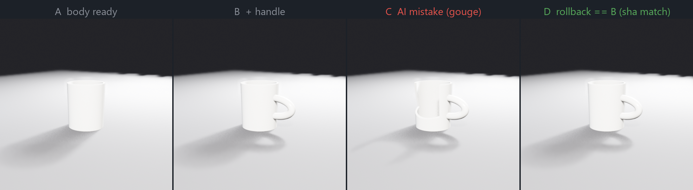
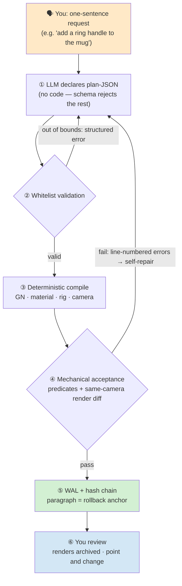
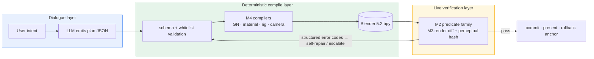

**English** | [简体中文](README.md)

<div align="center">

# Blender AI Modeling Console

**The LLM only declares plan-JSON, deterministic compilers land it in Blender, and mechanical verification guards every step — every dialogue paragraph is replayable, rollbackable, and auditable; every commit is backed by render diffs and ≈724 assertions.**

[](#license)
[](https://www.blender.org/)
[](https://docs.blender.org/api/current/)
[](#what-makes-it-different)
[](#why-trust-it)
[](#under-the-hood)

[What problem it solves](#what-problem-it-solves) · [What it looks like](#what-it-looks-like) · [What makes it different](#what-makes-it-different) · [A task end to end](#a-task-end-to-end) · [Under the hood](#under-the-hood) · [Quick start](#quick-start) · [Why trust it](#why-trust-it) · [Hard-won lessons](#hard-won-lessons) · [FAQ](#faq) · [Repository layout](#repository-layout) · [Verification](#verification-status) · [Roadmap](#roadmap)

</div>

## What problem it solves

Throw "build me a model" at the mainstream "AI + Blender" approach (the LLM writes and executes bpy scripts directly) and you hit three walls:

1. **Failures are silent.** A script that runs is not a model that's right — silent failures, geometric defects, API drift; the LLM knows none of it and confidently declares done.
2. **There is no way back.** Once the scene is dirty there is no "step back" anchor; which utterance changed what is unverifiable.
3. **Right today, broken tomorrow.** Every session starts from zero; experience doesn't accumulate, and without a regression fence, a path that worked yesterday can quietly break today.

This project's countermeasure in one sentence:

> **The LLM never produces executable code. Declarations go to deterministic compilers, acceptance goes to mechanical predicates, history goes to a WAL + hash chain — every step has teeth, and the teeth are tested themselves.**

## What it looks like

| Dialogue artifact · presentation rig | Same-camera render diff (ground truth for every commit) |
|---|---|
|  |  |

Left: a mug declared and compiled in dialogue — 192-segment tapered body, a real recessed rim, an elliptical-arc tube handle — **compiled node-by-node from a logic tree and shipped only after passing gates G1–G4** (three-point lighting + 50mm f/2.8 shallow DOF, EEVEE ~4s). Right: deterministic same-camera render diff — hard-edged cube → heavily beveled variant, changed pixels highlighted in red; re-rendering the same scene yields **0-pixel drift**, so the diff gate has zero false positives.

## What makes it different

- **Zero executable code from the LLM.** plan-JSON passes schema + whitelist validation; out-of-bounds input is rejected instantly with structured error codes. Compilers land deterministically — no "halfway through and the scene is dirty" intermediate state.
- **Acceptance is predicates, not vibes.** Structural / render / BIM / DFM predicate families are fully mechanical — draft angles, concave inner corners, wall uniformity, enclosed cavities — each with a geometric proof behind it (verifier's law).
- **Same-camera render diff as ground truth.** Frozen camera + deterministic Workbench rendering (17 ms/frame steady state); perceptual-hash three-tier separation (unchanged / small / large, thresholds calibrated); presentation rig and diff pipeline coexist and cross-validate at 0-pixel drift.
- **A paragraph is a triple boundary.** Each conversational paragraph is simultaneously an execution unit, a context-compaction unit, and a rollback unit (WAL + hash chain; replayable, rollbackable).
- **Contracts are the lever.** Measured: adding 4 lines of missing documentation moved LLM first-shot success from 0% to 80%. Contracts, error codes, and schemas are first-class citizens, not decoration.
- **Negative results are deliverables.** The vertex-fingerprint A/B concluded "don't ship it" and surfaced a Morton thin-layer scattering finding; when Blender 5.2 removed Delta Mush, the adjudication landed on Corrective Smooth — every negative result is archived with data.
- **Diversity has two rulers.** Pairwise comparison of N candidates per prompt: geometric (128³ voxel 1-IoU + three-axis EMD, Spearman 0.9639) + visual (8-view LPIPS, strict three-tier separation, thresholds published) — complementary by design: the visual ruler covers exactly where the voxel ruler is blind.

## A task end to end

1. **Declare** — "add a ring handle to the mug" produces a plan-JSON: nodes, parameters, materials, acceptance predicates — declared fields only, not a line of executable code.
2. **Validate** — schema validation + whitelist filtering; unknown fields, out-of-range values, and dangerous operations come back instantly with error codes.
3. **Compile** — deterministic compilers land it in a real Blender 5.2 scene (GN trees / procedural materials / Rigify rigs / cameras).
4. **Verify** — predicate family + same-camera render diff + perceptual hash; failures return structured errors → localize → self-repair, never a vague "try again".
5. **Commit** — WAL + hash chain; the paragraph becomes a rollback anchor; renders are archived under `results/` for the next regression.

## The logic tree: how the AI side works — and admits mistakes

A one-line request doesn't turn into operations directly — it is first decomposed into a **logic tree** (`blender_console/logic_trees/mug.json`). Each leaf node is a triple: **build recipe (compiled by the AI side) + machine gate (mechanically enforced) + visual note (human inspection)**, across four layers. Take "make a classic 350ml ceramic mug" (anchored to real retail specs):

| Layer | Node | Build (AI compiles this) | Machine gate (never downgraded) |
|---|---|---|---|
| L1 Container | 1.1 Cavity | EXACT boolean cavity cut, cutter breaks through the rim | Capacity ≥ 320 ml |
| L1 Container | 1.2 Wall | Outer taper R38→R40, inner cavity follows the taper | Ray samples ⊆ [4,7] mm |
| L2 Ergonomics | 2.1 Finger gap | Elliptical-arc tube handle, ends embedded 4 mm | Finger gap ≥ 28 mm (measured 32) |
| L3 Form | 3.1 Proportion | H 95 / Ø 80, 192 segments | H:Ø ∈ [1.09,1.29] (measured 1.188) |
| L4 Look | 4.2 Lighting | Three-point rig + Filmic dark studio | Non-empty + variance + blown < 5% |

**One tree, walked by both sides**: when generating a model, the AI decomposes the plan along the tree and compiles each leaf's build field; the gates enforce each machine criterion. Build recipes may deviate **declaratively** (real case: a cylindrical cavity conflicts with the capacity/wall dual gates → switched to a tapered cavity, deviation logged); gate numbers are never downgraded. All 12 nodes walked = G3 machine checks 13/13 green, every number archived in `results/mug_showcase_result.json`. This tree is not just a checklist for humans — **it is the AI side's walking map**.

### Every action is booked

Every AI action (modeling, gate decision, render, rollback) is appended to **a single append-only ledger** (`showcase/mug-ledger.jsonl`, human-auditable):

```json
{"ts": 1759056191.2, "actor": "AI", "act": "gate", "gate": "2.1 finger gap >= 28mm",
 "detail": "2.1 finger gap >= 28mm -> PASS | 3 ray hits: handle outer 85.0 / handle inner 71.0 / wall 39.0 → gap 32.0mm", "ok": true}
```

### Watch it roll back

The AI makes mistakes too — what matters is what happens next. A real-machine demo (`mug_rollback_live.py`): **A body → B add handle → C a mistaken gouge cuts the wall open → replay WAL events (skipping the destructive one) → D rollback**:



Rollback is not "undoing inspiration" — it is a mechanism: every action first lands in the WAL (hash-chained, tamper-evident); rollback = **deterministic replay of whitelisted events**. Triple reconciliation — mesh fingerprint D==B (2153 verts / 139.5 ml), per-vertex sha16 D==B (`f82f6eb980069cb3`), WAL hash chain `verify() = True`. The wrecked mug in frame C and the volume drop in the data (139.5 → 115.8 ml) stay on record — no pretending mistakes never happened.

## Under the hood





For those who want the mechanisms. Every item below maps to an implementation and an acceptance suite in the repo:

**1. Plan–compile–verify closed loop** — the LLM emits declarations (carried by the M1 data layer), compilers land them (M4), verifiers gate them (M2/M3). The three stages are independently replaceable and independently tested; structured error codes are the LLM's only entry point for self-repair.

**2. Paragraph semantics on WAL + hash chain** — every dialogue paragraph lands as a hash-chained WAL record; execution, compaction, and rollback share the same anchor; replay idempotency (same plan, same result) is asserted verbatim by the acceptance suites.

**3. Same-camera render diff** — the camera is fitted to the evaluated bounding box and then **frozen**; Workbench + STUDIO lighting renders deterministically (0-pixel difference on re-render); pixels are read back from PNGs on disk (the "`render()` returns only metadata" trap is bypassed); dHash / pHash / SSIM thresholds were calibrated against a three-tier variant battery.

**4. Two-ruler diversity calibration** — the online proxy (32³ vertex-histogram IoU) is scoped as a coarse gate; offline exact measures (128³ voxels + three-axis W1-EMD, Spearman 0.9639) do parameter-level discrimination; the visual ruler (8-view LPIPS mean, inference-only) separates strictly (near-pair upper bound 0.046 / far-pair lower bound 0.188) with 0.95 rank agreement against the geometric ruler in the parameter domain.

**5. DFM predicates are geometry, not heuristics** — draft (|nz| < sin(draft) flags zero-draft vertical walls), concave inner corners (`cross(n1,n2)·t<0`, sign probe-calibrated on an L-shape), wall uniformity (ray sampling p95/p05 ≤ 2:1), enclosed cavities (flood fill + Euler genus).

**6. Release engineering** — the 55-py deployment payload is normalized-diff-checked against mainline (zero drift); the release manifest is a 147-file five-layer inventory; the whl version is aligned in three places by assertion.

Ten modules, each with its own acceptance suite: **M1** data layer (FlowDAG / WAL+hash chain / replayable steps), **M2** verification layer (structural/render/BIM predicates + tiered gates), **M3** render layer (same-camera diff), **M4** compile layer (GN / materials incl. procedural / Rigify rigs), **M5** interaction layer (A/B dual compilation), **M6** experience store (preference learning + two-ruler diversity calibration), **M7** director mode, **M8** integration & release engineering, **M9** dialogue frontend, **M10** static web console.

## Quick start

```bash
git clone https://github.com/master666-max/blender-ai-console.git
cd blender-ai-console

# Live machine acceptance (requires the Python/bpy bundled with Blender 5.2)
python blender_console/m8r4_live.py     # material & presentation suite   20/20
python blender_console/m412b_live.py    # character pipeline integration  17/17

# Web console self-test (no Blender needed)
cd m9_web && node _selftest.mjs         # 42/42
```

Pure-Python unit tests (no bpy dependency): `python blender_console/test_upstream_store.py`

**Requirements**: live acceptance needs Blender 5.x (bundled Python ≥3.10); pure unit tests and the web self-test only need Python 3.10+ / Node 18+. MCP bridge launchers: Windows `m8_bridge\start_gn_bridge.bat`, macOS/Linux `m8_bridge/start_gn_bridge.sh` — both auto-detect Blender; if not found, set the `BLENDER_EXE` environment variable to the executable.

Passing these is the acceptance — every `_live.py` suite asserts inside a real Blender 5.2 session. All paths in the codebase are derived relative to the repo root; no machine-specific absolute paths anywhere, and acceptance results land in `results/` inside the repo.

## Why trust it

- **34 live acceptance suites ≈ 724 assertions** — every suite runs inside a real Blender 5.2 session, not a mock comforting itself; result JSONs land in `results/` for review.
- **The verifier is tested itself** — blind-write experiment (11 samples): 100% of artifacts that passed the verifier were semantically correct; the EXP-5 vertex-fingerprint A/B ran a full three-way comparison before concluding "don't ship it", with the adjudication data archived.
- **Determinism has measured backing** — 0-pixel difference on same-scene re-render; perceptual-hash three-tier separation validated across all metrics.
- **Every calibration number is reproducible** — EMD reconciliation Spearman 0.9639, LPIPS thresholds t_same=0.0464 / t_diff=0.1875, DFM predicates with positive/negative attribution — each backed by a result JSON and its script.
- **Release engineering is mechanical** — payload zero-drift diff check, five-layer manifest inventory, three-way version alignment; none may be skipped for a release.

## Hard-won lessons

All of these really happened and are now encoded in the acceptance suites (save yourself a round trip):

- **BOOLEAN EXACT does not fuse face-touching contact.** Two solids whose faces exactly coincide (zero volume overlap) pass boolean ops through unchanged — 12 faces and 24 edges stay side by side, zero concave edges appear. An L-shaped build must overlap the lug into the body.
- **`BMLoop` has no `.next`.** It's `link_loop_next`; the in-face edge direction is `link_loop_next.vert - vert`.
- **Holding a depsgraph reference before `read_factory_settings` = native segfault.** The factory reset destroys the view layer; touching it afterwards is `EXCEPTION_ACCESS_VIOLATION` with no Python stack. Scene reset must be the script's first action.
- **`render()` returns metadata only, never pixels.** Read pixels back via `bpy.data.images.load` on the written PNG, then `reshape(-1, 4)`.
- **SUBSURF collapses cylinder/cone ngon end-caps into spheres.** For shape-preserving densification use REMESH VOXEL.
- **`depsgraph.updates` is only readable inside a `depsgraph_update_post` handler.** Main flow, after `dg.update()`, and `evaluated_depsgraph_get()` all see it empty; and background RNA writes don't trigger updates — call `view_layer.update()` explicitly.
- **Headless rendering must clear the scene.** `--factory-startup` ships a default Cube; if you don't delete it, it photobombs your acceptance frames.

## FAQ

**Can the LLM write code at all?** No — the LLM channel only accepts plan-JSON. That's design, not limitation: an executable-code channel means no replay, no audit, and silent errors; the declarative channel turns all three into mechanically decidable facts.
**Will it mess up my existing scene?** Compilers only touch their own artifacts; rig cleanup is ownership-isolated by manifest (down to `.001` suffix fallback accounting), and manifest-less orphan objects are never touched.
**Does it need internet?** No. Everything is local except Blender itself; the LPIPS weights for visual-diversity calibration (233 MB) download once on first run, then it's fully offline.
**How do I verify the assertion numbers?** Every suite's result JSON is committed under `results/`; scripts derive paths relative to the repo root, so any machine can re-run them.

## Repository layout

| Path | Content |
|---|---|
| [`blender_console/`](blender_console/) | Console core + 34 `_live.py` machine acceptance suites + `logic_trees/` (AI-side plan templates) |
| [`m8_bridge/gn_deploy/`](m8_bridge/gn_deploy/) | Deployment payload (55 py, diff-checked against mainline) |
| [`m9_web/`](m9_web/) | Static web console + flicker diff viewer |
| [`release/`](release/) | Release manifest (147-file five-layer inventory) |
| [`showcase/`](showcase/) | Showcase images (every render on this page comes from real machine artifacts) |

## Verification status

M1–M10 mainline green; R7 deep-water AI-actionable items closed. Regression baseline: **34 suites ≈ 724 assertions**.

<details>
<summary><b>Suite highlights (click to expand)</b></summary>

| Suite | Covers |
|---|---|
| `m8r4_live` 20/20 | Procedural wood compile / replay idempotency / structured rejections / presentation rig + 0-drift cross-check |
| `exp5_live` 6/6 | Vertex fingerprint A/B: Gear FastCDC three-way, verdict "fall back to geometric fingerprints" |
| `m412b_live` 17/17 | Character pipeline console integration |
| `m412g_live` 8/8 | Multi-rig coexistence: ownership-isolated wipe / manifest exclusivity / dual-channel expressions |
| `m2_predicates_live` 54/54 | Structural predicates + DFM four (draft / inner fillet / wall uniformity / escape hole) with positives & negatives |
| `m412_live` 6/6 | Rig compiler, deformation quality IoU(128³) = 1.0 |
| `test_bim` 19/19 | BIM predicates (data-level) |
| `exp7_live` 3/3 | Process-gate three-way comparison (left-shift effect) |
| `m6_live` 31/31 | AB → preference learning / override write-back / diversity gate |
| `m64_lpips_live` 1+4 | Visual-diversity calibration: 28 pairs geometric V + 8-view LPIPS two-ruler reconciliation |
| `mug_showcase_live` 13/13 | Logic-tree-driven gates: G1 silhouette (human) + G3 machine checks (capacity / wall rays / finger gap / centroid…) + G4 predicates |
| `mug_rollback_live` | Rollback demo: WAL replay skips the destructive event; fingerprint / per-vertex sha / hash chain all reconcile D==B |
| Remaining 20+ suites | M1-M5 / M7 / M9 / M10 regression & smoke |

</details>

## Roadmap

- [x] M1–M10 mainline + release inversion (whl 2.1.0-gn pinned)
- [x] R7 deep water: character pipeline (incl. console integration) / EMD calibration / BIM predicates / material assets / vertex-fingerprint verdict / multi-rig coexistence / DFM four predicates / depsgraph experiment family / pHash+SSIM calibration
- [x] R7h: M6-4 visual-diversity LPIPS calibration (8 views, two-ruler reconciliation closed)
- [x] Facade logic tree: one line → tree decomposition → per-leaf gates (the AI side's walking map) + action ledger + real-machine WAL rollback demo
- [ ] M9-5 flicker vs side-by-side preference A/B (flicker.html ready; needs human experiment)
- [ ] Long-term: annotation back-reference · audio channel · HAMT (adjudication on hold ◐) · ARKit-52 expression shape assets

## Acknowledgments

- **[mcp-for-blender](https://github.com/ahujasid/blender-mcp)** (MIT, © 2025 Siddharth Ahuja) — the transport layer (sandbox, telemetry, consent and config modules) is vendored under [`m8_bridge/brickfly_mcp_src/`](m8_bridge/brickfly_mcp_src/) and extended with 8 GN tool bindings; its original license notice is preserved in that directory's [LICENSE](m8_bridge/brickfly_mcp_src/LICENSE).
- **[Blender](https://www.blender.org/)** and the bpy community — the substrate everything runs on.

## License

<div align="center">

[MIT](LICENSE) © 2026 · *Treat every pixel with engineering discipline.*

</div>
