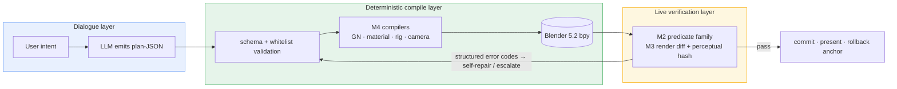

**English** | [简体中文](README.md)

<div align="center">

# Blender AI Modeling Console

**LLMs should declare models, not write scripts.**

[](LICENSE)
[](https://www.blender.org/)
[](https://docs.blender.org/api/current/)
[](#verification-status)

[What is this](#what-is-this) · [Key features](#key-features) · [Quick start](#quick-start) · [Architecture](#architecture) · [Verification](#verification-status) · [Roadmap](#roadmap)

</div>

## What is this

An AI modeling console that runs inside Blender 5.2.

Most "AI + Blender" integrations let the LLM write and execute bpy scripts. It works — until you need to replay, audit, or undo. This project takes a different path: **the LLM only declares plan-JSON, deterministic compilers land it, and a mechanical verifier guards every step**.

Every conversational paragraph is a replayable, rollbackable, auditable unit; every commit is backed by same-camera render diffs and 29 live acceptance suites (≈688 assertions).

## Key features

- **Plan–compile–verify closed loop** — The LLM never produces executable code; schema + whitelist validation rejects anything out of bounds, and deterministic compilers land the rest.
- **Zero silent escapes** — Compiler failures throw loudly and roll back; geometric defects are caught by a mechanical verifier. Across 11 blind-write runs, every artifact that passed the verifier was semantically correct.
- **Contract quality is the lever** — Measured: adding 4 lines of missing documentation moved LLM first-shot success from 0% to 80%. Contracts, error codes, and schemas are first-class citizens here.
- **A paragraph is a triple boundary** — Each conversational paragraph is simultaneously an execution unit, a context-compaction unit, and a rollback unit (WAL + hash chain; replayable, rollbackable).
- **Same-camera render diff as ground truth** — Fixed-camera renders + perceptual hashing; the presentation rig and the diff pipeline coexist as two profiles, state restored after every render, cross-validated at 0-pixel drift.
- **Negative results are deliverables** — The vertex-fingerprint A/B concluded "don't ship it" and surfaced a Morton thin-layer scattering finding; when Blender 5.2 removed Delta Mush, the adjudication landed on Corrective Smooth.

## Quick start

```bash
git clone https://github.com/master666-max/blender-ai-console.git
cd blender-ai-console

# Live machine acceptance (requires the Python/bpy bundled with Blender 5.2)
python blender_console/m8r4_live.py     # material & presentation suite   20/20
python blender_console/m412b_live.py    # character pipeline integration  17/17

# Web console self-test (no Blender needed)
cd m9_web && node _selftest.mjs         # 42/42
```

Pure-Python unit tests (no bpy dependency): `python blender_console/test_upstream_store.py`

Passing these is the acceptance — every `_live.py` suite asserts inside a real Blender 5.2 session. All paths in the codebase are derived relative to the repo root; no machine-specific absolute paths anywhere.

## Architecture



Ten modules, each with its own acceptance suite: **M1** data layer (FlowDAG / WAL+hash chain / replayable steps), **M2** verification layer (structural/render/BIM predicates + tiered gates), **M3** render layer (same-camera diff), **M4** compile layer (GN / materials incl. procedural / Rigify rigs), **M5** interaction layer (A/B dual compilation), **M6** experience store (preference learning + EMD offline calibration), **M7** director mode, **M8** integration & release engineering, **M9** dialogue frontend, **M10** static web console.

## Repository layout

| Path | Content |
|---|---|
| [`blender_console/`](blender_console/) | Console core + 29 `_live.py` machine acceptance suites |
| [`m8_bridge/gn_deploy/`](m8_bridge/gn_deploy/) | Deployment payload (55 py, diff-checked against mainline) |
| [`m9_web/`](m9_web/) | Static web console + flicker diff viewer |
| [`release/`](release/) | Release manifest (147-file five-layer inventory) |

## Verification status

M1–M10 mainline green; R7 deep-water AI-actionable items closed. Regression baseline: **29 suites ≈ 688 assertions**.

<details>
<summary><b>Suite highlights (click to expand)</b></summary>

| Suite | Covers |
|---|---|
| `m8r4_live` 20/20 | Procedural wood compile / replay idempotency / structured rejections / presentation rig + 0-drift cross-check |
| `exp5_live` 6/6 | Vertex fingerprint A/B: Gear FastCDC three-way, verdict "fall back to geometric fingerprints" |
| `m412b_live` 17/17 | Character pipeline console integration |
| `m412_live` 6/6 | Rig compiler, deformation quality IoU(128³) = 1.0 |
| `test_bim` 19/19 | BIM predicates (data-level) |
| `exp7_live` 3/3 | Process-gate three-way comparison (left-shift effect) |
| `m6_live` 31/31 | AB → preference learning / override write-back / diversity gate |
| Remaining 20+ suites | M1-M5 / M7 / M9 / M10 regression & smoke |

</details>

## Roadmap

- [x] M1–M10 mainline + release inversion (whl 2.1.0-gn pinned)
- [x] R7 deep water: character pipeline (incl. console integration) / EMD calibration / BIM predicates / material assets / vertex-fingerprint verdict
- [ ] M9-5 flicker vs side-by-side preference A/B (flicker.html ready; needs human experiment)
- [ ] Long-term: annotation back-reference · audio channel · HAMT · ARKit-52 blendshapes · multi-rig coexistence

## Acknowledgments

- **[mcp-for-blender](https://github.com/ahujasid/blender-mcp)** (MIT, © 2025 Siddharth Ahuja) — the transport layer (sandbox, telemetry, consent and config modules) is vendored under [`m8_bridge/brickfly_mcp_src/`](m8_bridge/brickfly_mcp_src/) and extended with 8 GN tool bindings; its original license notice is preserved in that directory's [LICENSE](m8_bridge/brickfly_mcp_src/LICENSE).
- **[Blender](https://www.blender.org/)** and the bpy community — the substrate everything runs on.

## License

<div align="center">

[MIT](LICENSE) © 2026 · *Treat every pixel with engineering discipline.*

</div>
