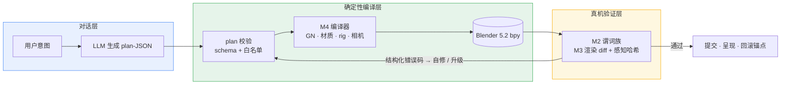

<div align="center">

# Blender AI 建模控制台

**让 LLM 用「编译器」建模，而不是写 bpy 脚本**

*plan-JSON → 确定性编译（GN / 材质 / 相机 / 角色 rig）→ 真机 verifier 闭环*

[](LICENSE)
[](https://www.blender.org/)
[](https://docs.blender.org/api/current/)
[](#验收状态)
[](https://github.com/master666-max/blender-ai-console/stargazers)

[核心理念](#核心理念) · [架构](#架构) · [快速开始](#快速开始) · [仓库结构](#仓库结构) · [验收状态](#验收状态) · [路线图](#路线图)

</div>

---

## 核心理念

主流「AI + Blender」方案让 LLM 直接生成并执行 bpy 脚本——灵活，但不可重放、不可审计、错了只能重来。本项目换了一条路：

| | LLM 直写脚本 | 本项目（plan–compile–verify） |
|---|---|---|
| LLM 的产出 | 可执行代码（不可控） | **plan-JSON**（schema 校验 + 白名单，schema 外直接拒绝） |
| 落地方式 | 逐次执行，状态漂移 | **确定性编译器**：幂等重放、指纹对账、可撤销 |
| 出错时 | 崩溃 / 静默坏档 | **结构化错误码**反馈，可自修的走自修，需确认的升级 |
| 验证 | 人眼看 | **真机 verifier**：谓词族 + 同机位渲染 diff + 感知哈希 |

配套工程纪律：段落 = 执行边界（WAL + 哈希链）、上游隔离区（只吸收不 import）、发布门禁全量回归、台账诚实登记不虚标。

## 架构



十个模块各司其职：**M1** 数据层（FlowDAG / WAL+哈希链 / Step 可重放）· **M2** 验证层（结构/渲染/BIM 谓词 + 分级门禁）· **M3** 渲染层（同机位 Workbench diff）· **M4** 编译层（GN / 材质含 procedural / Rigify rig）· **M5** 交互层（A/B 双编译对照）· **M6** 经验库（偏好学习 + EMD 离线标定）· **M7** 导演模式（段落规划 / 呈现档与 diff 两档并存）· **M8** 融合工程（标准包发布）· **M9** 前端（对话即前端 / 闪烁 diff）· **M10** Web 静态控制台。

## 快速开始

```bash
git clone https://github.com/master666-max/blender-ai-console.git
cd blender-ai-console

# 真机验收（需 Blender 5.2 的 bpy 环境）
python blender_console/m8r4_live.py     # 素材转正验收  20/20
python blender_console/m412b_live.py    # 角色管线集成  17/17

# Web 控制台自检（无需 Blender）
cd m9_web && node _selftest.mjs         # 42/42
```

纯 Python 单测（秒级）：`pytest blender_console/test_escape.py blender_console/test_intake.py`

## 仓库结构

| 目录 | 内容 |
|---|---|
| [`blender_console/`](blender_console/) | 控制台主体 + 29 套 `_live.py` 真机验收 |
| [`m8_bridge/gn_deploy/`](m8_bridge/gn_deploy/) | 部署载荷（55 py，与主线 diff 校验零漂移） |
| [`m9_web/`](m9_web/) | 静态 Web 控制台 + 闪烁 diff 查看器 |
| [`release/`](release/) | 发布 manifest（147 文件五层清单，whl 2.1.0-gn） |
| [`上游隔离区/`](<上游隔离区/>) | 只读上游素材（机制库 / 工艺库），不 import、只吸收 |
| [`深度调研/`](深度调研/) · [`预调研/`](预调研/) · [`算法路线调研/`](算法路线调研/) | 方法学依据（增量/缓存/指纹、工艺约束、交互协议） |
| 工单 / 交接文档 / 进度规划 | 过程台账：决策、验收口径、诚实缺口登记 |

## 验收状态

M1–M10 主线全绿，R7 深水区 AI 可做项收官。回归基线 **29 套 ≈ 688 断言**。

<details>
<summary><b>验收套件明细（点击展开）</b></summary>

| 套件 | 覆盖 |
|---|---|
| `m8r4_live` 20/20 | WD_wood procedural 编译 / 重放幂等 / 反例三连 / 呈现档 + M9-3 互证 0 漂移 |
| `exp5_live` 6/6 | 顶点指纹 A/B：Gear FastCDC 三路对照，判定退回几何量指纹 |
| `m412b_live` 17/17 | M4-12b console 段落级集成 |
| `m412_live` 6/6 | rig 编译器，形变质量 IoU(128³)=1.0 |
| `test_bim` 19/19 | M2-8 BIM 谓词（纯 Python 数据级） |
| `exp7_live` 3/3 | 工艺门禁三组对照（左移效应） |
| `m6_live` 31/31 | AB→偏好学习 / override 回写 / 多样性闸门 |
| `m9_intake_live` 22/22 · `test_intake` 22/22 · `test_escape` 16/16 | 提问协议 / 逃逸舱 |
| 其余 20 套 | M1-M5/M7/M9/M10 各层真机与冒烟回归 |

</details>

## 路线图

- [x] M1–M10 主线 + 发布反转（whl 2.1.0-gn 定版）
- [x] R7 深水区：M4-12 角色管线（含 console 集成）/ M6-4 EMD 标定 / M2-8 BIM 谓词 / M8-R4 素材转正 / EXP-5 顶点指纹判定
- [ ] M9-5 闪烁 vs 并排偏好 A/B（flicker.html 已就绪，待真人实验）
- [ ] 远期：M9-6 标注反查 · M9-7 声音通道 · M1-5b HAMT · ARKit-52 表情 schema · 多 rig 共存

## License

<div align="center">

[MIT](LICENSE) © 2026 · 以工程纪律对待每一个像素

</div>
