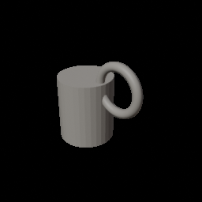
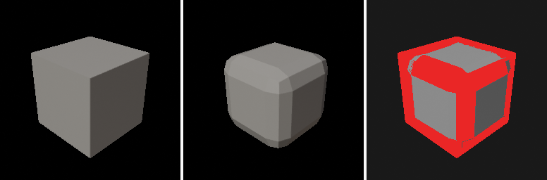
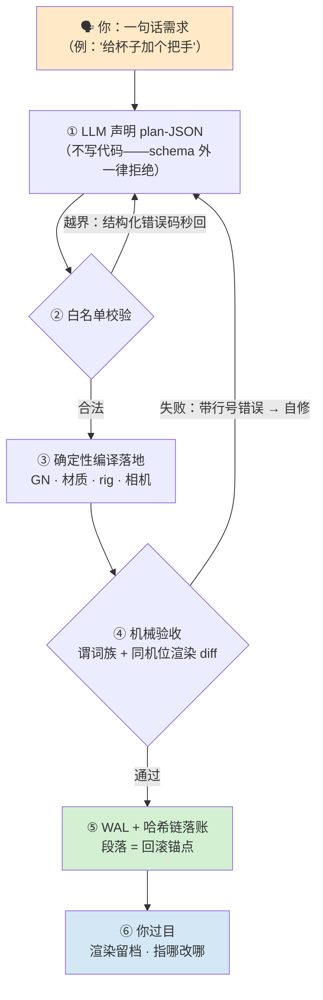
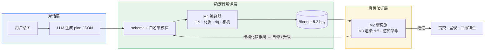

[English](README.en.md) | **简体中文**

<div align="center">

# Blender AI 建模控制台

**LLM 只声明 plan-JSON，确定性编译器在 Blender 里落地，机械验收把守每一步——每段对话可重放、可回退、可审计，每次提交都有渲染 diff 与 ≈724 条断言背书。**

[](#license)
[](https://www.blender.org/)
[](https://docs.blender.org/api/current/)
[](#它有什么不一样)
[](#凭什么信它)
[](#技术内幕)

[它解决什么问题](#它解决什么问题) · [效果长这样](#效果长这样) · [它有什么不一样](#它有什么不一样) · [一个任务从头到尾](#一个任务从头到尾) · [技术内幕](#技术内幕) · [快速开始](#快速开始) · [凭什么信它](#凭什么信它) · [踩过的坑](#踩过的坑) · [常见问题](#常见问题) · [仓库结构](#仓库结构) · [验收状态](#验收状态) · [路线图](#路线图)

</div>

## 它解决什么问题

把"帮我建个模型"直接扔给当前的「AI + Blender」方案（LLM 直接写并执行 bpy 脚本），几乎必然撞上三堵墙：

1. **错了不响。** 脚本能跑 ≠ 做对了——静默失败、几何缺陷、API 漂移，LLM 一概不知，还会自信地宣布完成。
2. **干坏了回不去。** 场景被改脏之后没有"退回上一步"的锚点；哪句对话干的、动了什么，无从对证。
3. **这次对，下次废。** 每个会话从零摸，经验不沉淀；没有回归防线，昨天能跑通的路径今天就敢悄悄坏给你看。

这个项目的对策浓缩成一句话：

> **LLM 永不产出可执行代码；声明交给确定性编译器，验收交给机械谓词，历史交给 WAL + 哈希链——每一步都有牙齿，且牙齿自己被测试咬过。**

## 效果长这样

| 对话段落产物 | 同机位渲染 diff（每次提交的地面真值） |
|---|---|
|  |  |

左：AI 在对话中一步步声明、编译出来的杯子（环形把手，M6 A/B 双方案帧）。右：同机位确定性渲染 diff——硬边立方 → 大倒角变体，变化区红色高亮；同场景重渲 **0 像素漂移**，所以 diff 门禁零误报。

## 它有什么不一样

- **LLM 零可执行代码。** 声明 plan-JSON 过 schema + 白名单，越界输入秒拒并回结构化错误码；编译器确定性落地，不存在"跑到一半弄脏场景"的中间态。
- **验收是谓词，不是感觉。** 结构 / 渲染 / BIM / DFM 谓词族全机械判定——拔模角、凹内角、壁厚均匀性、封闭内腔，每条都有几何实锤依据（verifier's law）。
- **同机位渲染 diff 作地面真值。** 冻结相机 + Workbench 确定性渲染（稳态 17ms/帧），感知哈希三档分离（未变 / 小改 / 大改阈值已标定）；呈现档与 diff 管线两档并存，互证 0 像素漂移。
- **段落 = 三重边界。** 每个对话段落同时是执行单元、上下文压缩单元、回退单元（WAL + 哈希链，可重放、可回溯撤销）。
- **契约即杠杆。** 实测补 4 行缺失文档，LLM 首版成功率 0% → 80%——契约、错误码、schema 是一等公民，不是文档装饰。
- **负结果也是交付。** 顶点指纹 A/B 判定「不接入」并发现 Morton 薄层散射；Blender 5.2 移除 Delta Mush 后裁决 Corrective Smooth 替代——每条负结果带数据落盘，不装没踩过坑。
- **多样性有两把尺。** 同 prompt N 产出的两两比较：几何（128³ 体素 1-IoU + 三轴 EMD，Spearman 0.9639）+ 视觉（8 视角 LPIPS，三档严格分离，阈值落表）——双尺互补，几何尺对"同体积异形"钝感的地方视觉尺补位。

## 一个任务从头到尾

1. **声明**——"给杯子加个环形把手"换来的是一段 plan-JSON：节点、参数、材质、验收谓词，全是声明字段，没有一行可执行代码。
2. **校验**——schema 校验 + 白名单过滤，未知字段、越界值、危险操作全部带错误码秒回。
3. **编译**——确定性编译器落地到真实 Blender 5.2 场景（GN 树 / procedural 材质 / Rigify rig / 相机）。
4. **验收**——谓词族 + 同机位渲染 diff + 感知哈希；失败回结构化错误 → 定位 → 自修，不带"再调调"式的模糊重试。
5. **落账**——WAL + 哈希链写入，段落即回滚锚点；渲染留档 `results/`，下次回归直接对帧。

## 技术内幕





给想看机制的人。每条都能在仓内找到对应实现与验收套件：

**1. Plan–compile–verify 三段闭环**——LLM 产出声明（M1 数据层承载），编译器落地（M4），验收器把门（M2/M3）。三段各自可独立替换、独立测试；验收失败的结构化错误码是 LLM 自修的唯一入口。

**2. WAL + 哈希链的段落语义**——每个对话段落落一条带哈希链的 WAL 记录，段落的执行、压缩、回退共用同一锚点；重放幂等（同 plan 重编译结果一致）由验收套件逐字断言。

**3. 同机位渲染 diff**——相机按求值网格包围盒拟合后**冻结**；Workbench + STUDIO 光确定性渲染，同场景重渲 0 像素差；像素从落盘 PNG 回读（`render()` 只回 meta 的坑已绕开）；dHash/pHash/SSIM 三度量阈值经三档变体标定。

**4. 多样性双尺标定**——在线代理（32³ 顶点直方图 IoU）定位为粗筛闸门，离线精确度量（128³ 体素 + 三轴 W1-EMD，Spearman 0.9639）做参数级判别；视觉尺（8 视角 LPIPS 均值，纯推理零训练）三档严格分离（近邻对上界 0.046 / 远邻对下界 0.188），参数级域与几何尺排序一致性 0.95。

**5. DFM 谓词的物理依据**——拔模（|nz| < sin(draft) 判零拔模竖直壁）、凹内角（`cross(n1,n2)·t<0` 符号经 L 形探针真机校准）、壁厚均匀性（射线采样 p95/p05 ≤ 2:1）、封闭内腔（连通分量洪泛 + Euler genus）——不是启发式，是几何。

**6. 部署工程**——部署载荷 55 py 与主线归一化 diff 零漂移；发布 manifest 147 文件五层清单；whl 版本三处对齐断言。

十个模块各带验收套件：**M1** 数据层（FlowDAG / WAL+哈希链 / Step 可重放）、**M2** 验证层（结构/渲染/BIM 谓词 + 分级门禁）、**M3** 渲染层（同机位 diff）、**M4** 编译层（GN / 材质含 procedural / Rigify rig）、**M5** 交互层（A/B 双编译）、**M6** 经验库（偏好学习 + 多样性双尺标定）、**M7** 导演模式、**M8** 融合与发布工程、**M9** 对话前端、**M10** 静态 Web 控制台。

## 快速开始

```bash
git clone https://github.com/master666-max/blender-ai-console.git
cd blender-ai-console

# 真机验收（需 Blender 5.2 自带 Python / bpy）
python blender_console/m8r4_live.py     # 素材与呈现套件     20/20
python blender_console/m412b_live.py    # 角色管线集成       17/17

# Web 控制台自检（无需 Blender）
cd m9_web && node _selftest.mjs         # 42/42
```

纯 Python 单测（无 bpy 依赖）：`python blender_console/test_upstream_store.py`

**环境要求**：真机验收需 Blender 5.x（自带 Python ≥3.10）；纯单测与 Web 自检只需 Python 3.10+ / Node 18+。MCP 起桥入口：Windows `m8_bridge\start_gn_bridge.bat`，macOS/Linux `m8_bridge/start_gn_bridge.sh`——两者都会自动探测 Blender，找不到时设环境变量 `BLENDER_EXE` 指向可执行文件即可。

跑通即验收——每套 `_live.py` 都在真实 Blender 5.2 会话里断言。全仓库路径均相对仓库根推导，不含任何机器相关的绝对路径；验收结果统一落盘到仓库内 `results/`。

## 凭什么信它

- **34 套真机验收 ≈ 724 断言**——每套都在真实 Blender 5.2 会话跑，不在 mock 里自我安慰；结果 JSON 统一落盘 `results/` 可复核。
- **验收器自己也被测**——盲写实验（11 样本）：过 verifier 的产物语义 100% 正确；EXP-5 顶点指纹 A/B 走完整对照后判定「不接入」，判定过程与数据全部留档。
- **确定性有实测背书**——同场景重渲 0 像素差；感知哈希三档分离带（unchanged / small / large）全度量验证。
- **标定数字全部可复算**——EMD 对账 Spearman 0.9639、LPIPS 阈值 t_same=0.0464 / t_diff=0.1875、DFM 谓词正反例归因，每条都有 result JSON 与脚本。
- **发布工程机械化**——部署载荷与主线 diff 零漂移校验、manifest 五层清单、版本三处对齐，缺一不发版。

## 踩过的坑

以下全部真实发生并写进验收套件（欢迎少踩一遍）：

- **BOOLEAN EXACT 面贴面接触不融合。** 两块面正好贴合（零体积重叠）时布尔运算原样并列、不报错——12 面 24 边原样保留、零凹边产生。构造 L 形必须让 lug 侵入主体。
- **`BMLoop` 没有 `.next`。** 是 `link_loop_next`；面内沿边方向 = `link_loop_next.vert - vert`。
- **`read_factory_settings` 前持有 depsgraph 引用 = 原生段错误。** factory 重置销毁 view layer，之后一碰就是 `EXCEPTION_ACCESS_VIOLATION`，且没有 Python 栈可看。清场必须是脚本首动作。
- **`render()` 只回 meta 不回像素。** 像素必须 PNG 落盘后 `bpy.data.images.load` 回读，再 `reshape(-1, 4)`。
- **SUBSURF 会把圆柱/圆锥的 ngon 端面收缩成球状。** 要保形均匀密集化，用 REMESH VOXEL。
- **`depsgraph.updates` 仅在 `depsgraph_update_post` handler 内可读。** 主流程、`dg.update()` 之后、`evaluated_depsgraph_get()` 里全都是空的；且后台 RNA 写不自动触发更新，须显式 `view_layer.update()`。
- **后台渲染必须清场。** `--factory-startup` 场景自带默认 Cube，不删它会进你的验收帧。

## 常见问题

**LLM 完全不能写代码吗？** 对——本项目的 LLM 通道只接受 plan-JSON。这是设计而不是限制：可执行代码通道意味着不可重放、不可审计、错误静默；声明式通道把这三样全部变成机械可判定。
**会弄乱我已有的场景吗？** 编译器只动自己产物；rig 清理按归属名单隔离（连 `.001` 重名兜底都对账），无名单的孤儿对象一律不碰。
**必须联网吗？** 不必。除 Blender 本体外全部本地；多样性视觉标定用的 LPIPS 权重（233MB）首次运行自动下载，之后离线。
**断言数字怎么复核？** `results/` 下每套验收的 result JSON 落盘在库，脚本路径相对仓库根推导，任何机器可重跑。

## 仓库结构

| 路径 | 内容 |
|---|---|
| [`blender_console/`](blender_console/) | 控制台主体 + 34 套 `_live.py` 真机验收 |
| [`m8_bridge/gn_deploy/`](m8_bridge/gn_deploy/) | 部署载荷（55 py，与主线 diff 校验一致） |
| [`m9_web/`](m9_web/) | 静态 Web 控制台 + 闪烁 diff 查看器 |
| [`release/`](release/) | 发布 manifest（147 文件五层清单） |
| [`showcase/`](showcase/) | 门面展示图（本页所用渲染均出自真机产物） |

## 验收状态

M1–M10 主线全绿；R7 深水区 AI 可做项收官。回归基线：**34 套 ≈ 724 断言**。

<details>
<summary><b>套件亮点（点击展开）</b></summary>

| 套件 | 覆盖 |
|---|---|
| `m8r4_live` 20/20 | Procedural 木纹编译 / 重放幂等 / 结构化拒绝 / 呈现档 + 0 漂移互证 |
| `exp5_live` 6/6 | 顶点指纹 A/B：Gear FastCDC 三路对照，判定"退回几何量指纹" |
| `m412b_live` 17/17 | 角色管线 console 集成 |
| `m412g_live` 8/8 | 多 rig 共存：wipe 归属隔离 / 名单互斥 / 双通道表情共存 |
| `m2_predicates_live` 54/54 | 结构谓词 + DFM 四谓词（拔模 / 凹内角 / 壁厚 / 逃逸孔）正反例 |
| `m412_live` 6/6 | rig 编译器，形变质量 IoU(128³) = 1.0 |
| `test_bim` 19/19 | BIM 谓词（数据级） |
| `exp7_live` 3/3 | 工艺门禁三组对照（左移效应） |
| `m6_live` 31/31 | AB → 偏好学习 / override 回写 / 多样性闸门 |
| `m64_lpips_live` 1+4 | 视觉多样性标定：28 对几何 V + 8 视角 LPIPS 双尺对账 |
| 其余 20+ 套 | M1-M5 / M7 / M9 / M10 回归与冒烟 |

</details>

## 路线图

- [x] M1–M10 主线 + 发布反转（whl 2.1.0-gn 定版）
- [x] R7 深水区：角色管线（含 console 集成）/ EMD 标定 / BIM 谓词 / 材质素材 / 顶点指纹判定 / 多 rig 共存 / DFM 四谓词 / depsgraph 实验族 / pHash+SSIM 标定
- [x] R7h：M6-4 视觉多样性 LPIPS 标定（8 视角，双尺对账闭环）
- [ ] M9-5 闪烁 vs 并排偏好 A/B（flicker.html 已就绪，待真人实验）
- [ ] 远期：标注反查 · 声音通道 · HAMT（裁决维持 ◐）· ARKit-52 表情 shape 资产

## 致谢

- **[mcp-for-blender](https://github.com/ahujasid/blender-mcp)**（MIT，© 2025 Siddharth Ahuja）——传输层（沙箱 / 遥测 / 知情同意 / 配置模块）以 vendored 方式收录于 [`m8_bridge/brickfly_mcp_src/`](m8_bridge/brickfly_mcp_src/)，并在其上扩展了 8 个 GN 工具绑定；原许可声明保留于该目录的 [LICENSE](m8_bridge/brickfly_mcp_src/LICENSE)。
- **[Blender](https://www.blender.org/)** 与 bpy 社区——一切运行其上的地基。

## License

<div align="center">

[MIT](LICENSE) © 2026 · *以工程纪律对待每一个像素。*

</div>
