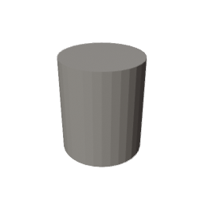
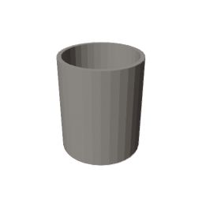
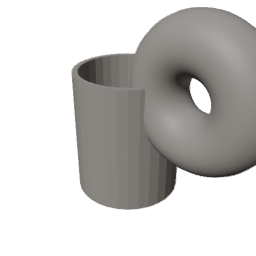
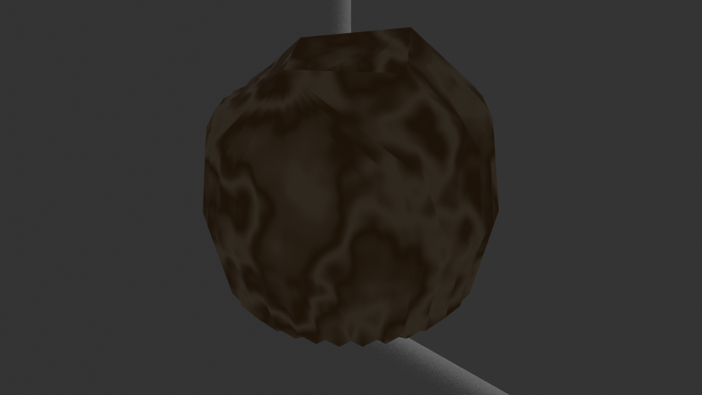
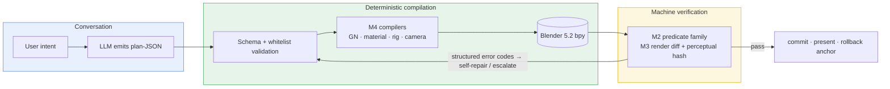

**English** | [简体中文](README.zh-CN.md)

<div align="center">

# Blender AI Modeling Console

**LLMs should declare models, not write scripts.**

*A plan–compile–verify console for Blender: the LLM emits plan-JSON, deterministic compilers land it in Geometry Nodes / materials / cameras / rigs, and a machine verifier gates every step.*

[](LICENSE)
[](https://www.blender.org/)
[](https://docs.blender.org/api/current/)
[](#verification-status)
[](https://github.com/master666-max/blender-ai-console/stargazers)

[Core Ideas](#core-ideas) · [Architecture](#architecture) · [Quick Start](#quick-start) · [Repo Layout](#repo-layout) · [Verification Status](#verification-status) · [Roadmap](#roadmap)

  

*One mug, three consecutive plan steps — body → hollow → handle — each compiled and verified independently. Presentation frame (EEVEE, three-point rig, procedural wood):* 

</div>

---

## Core Ideas

Most "AI + Blender" integrations let the LLM write and execute bpy scripts. It works — until you need to replay, audit, or undo. This project takes a different position, and every claim below is backed by an in-repo experiment or a regression suite:

| # | Idea | What it means | Evidence |
|---|---|---|---|
| 1 | **Plan–compile–verify closed loop** | The LLM never produces executable code. It declares **plan-JSON**, validated against schema + whitelists (anything outside is rejected), then deterministic compilers land it. | Schema-gated plans; 29 live suites, ≈688 assertions |
| 2 | **Zero silent escapes** | Compiler failures are *loud* (adapter throws and rolls back); geometric defects are caught by a mechanical verifier (non-manifold / zero-area / budget / scale). In EXP-1, **all samples that passed the verifier were semantically correct — 0 silent escapes across 11 blind-write runs**. | EXP-1 report; EXP-7 gate experiments |
| 3 | **Contract quality is the lever** | The single biggest factor in LLM first-shot success was DSL contract completeness: **4 lines of missing documentation moved first-shot success from 0% to 80%**. So contracts, error codes, and schemas are first-class artifacts here. | EXP-1 (n=11, same task, blind-write discipline) |
| 4 | **A paragraph is a triple boundary** | Each conversational paragraph is simultaneously an execution unit, a context-compaction unit, and a rollback unit: WAL + hash chain, step replay, revision + backdating, and intent-level cascading selective undo. | Berlage '94, Cass '06 lineage; M1 suite |
| 5 | **Same-camera render diff as ground truth** | Verification uses fixed-camera Workbench renders + perceptual hashing. A separate presentation rig (three-point lighting, DOF) coexists with the diff pipeline — **restored after every render, 0-pixel drift cross-validated**. | M3 + M9-3 cross-check (dhash identical) |
| 6 | **Negative results are deliverables** | Experiments that fail are documented as pit-avoidance assets: the vertex-fingerprint study (Gear/FastCDC vs full recompute) concluded "don't ship it" and surfaced a Morton thin-layer scattering finding; the Delta-Mush removal in Blender 5.2 was adjudicated to Corrective Smooth. | EXP-5 (6/6), EXP-7 (3/3), adjudication ledger |

Plus one rule that shapes the whole repo: **the upstream isolation zone** — third-party code is absorbed, never imported, with provenance tracked.

## Architecture



Ten modules, each with its own acceptance suite: **M1** data (FlowDAG / WAL + hash chain / step replay), **M2** verification (structure / render / BIM predicates + tiered gates), **M3** rendering (same-camera diff), **M4** compilation (GN / materials incl. procedural / Rigify rigs), **M5** interaction (A/B dual-compile), **M6** experience (preference learning + EMD offline calibration), **M7** director mode, **M8** fusion & release engineering, **M9** conversational frontend, **M10** static web console.

## Quick Start

```bash
git clone https://github.com/master666-max/blender-ai-console.git
cd blender-ai-console

# Live acceptance (needs Blender 5.2's bundled Python / bpy)
python blender_console/m8r4_live.py     # material & presentation suite  20/20
python blender_console/m412b_live.py    # character pipeline integration 17/17

# Web console self-test (no Blender required)
cd m9_web && node _selftest.mjs         # 42/42
```

Pure-Python unit tests (no bpy): `python blender_console/test_upstream_store.py`

All paths in the codebase are derived relative to the repo root — no machine-specific absolute paths.

## Repo Layout

| Path | Content |
|---|---|
| [`blender_console/`](blender_console/) | Console core + 29 `_live.py` machine acceptance suites |
| [`m8_bridge/gn_deploy/`](m8_bridge/gn_deploy/) | Deployment payload (55 py, diff-checked against mainline) |
| [`m9_web/`](m9_web/) | Static web console + flicker diff viewer |
| [`release/`](release/) | Release manifest (147-file five-layer inventory) |
| [`docs/img/`](docs/img/) | Rendered frames used in this README |
| [`上游隔离区/`](<上游隔离区/>) | Read-only upstream material (mechanism & craft library) — absorbed, never imported |
| [`深度调研/`](深度调研/) · [`预调研/`](预调研/) · [`算法路线调研/`](算法路线调研/) | Academic pre-research backing the design decisions |
| Work-order / handover / planning ledgers | Decision records, acceptance criteria, honest known-gaps |

## Verification Status

M1–M10 mainline green; R7 deep-water AI-actionable items closed. Regression baseline: **29 suites ≈ 688 assertions**.

<details>
<summary><b>Suite highlights (click to expand)</b></summary>

| Suite | Covers |
|---|---|
| `m8r4_live` 20/20 | Procedural wood compile / replay idempotency / structured rejections / presentation rig + 0-drift cross-check |
| `exp5_live` 6/6 | Vertex fingerprint A/B: Gear FastCDC three-way, verdict "fall back to geometric fingerprints" |
| `m412b_live` 17/17 | Character pipeline console integration |
| `m412_live` 6/6 | Rig compiler, deformation quality IoU(128³) = 1.0 |
| `test_bim` 19/19 | BIM predicates (data-level) |
| `exp7_live` 3/3 | Process-gate three-way comparison (left-shift effect) |
| `m6_live` 31/31 | AB → preference learning / override write-back / diversity gate |
| Remaining 20+ suites | M1-M5 / M7 / M9 / M10 regression & smoke |

</details>

## Roadmap

- [x] M1–M10 mainline + release inversion (whl 2.1.0-gn pinned)
- [x] R7 deep water: character pipeline (incl. console integration) / EMD calibration / BIM predicates / material assets / vertex-fingerprint verdict
- [ ] M9-5 flicker vs side-by-side preference A/B (flicker.html ready; needs human experiment)
- [ ] Long-term: annotation back-reference · audio channel · HAMT · ARKit-52 blendshapes · multi-rig coexistence

## License

<div align="center">

[MIT](LICENSE) © 2026 · *Treat every pixel with engineering discipline.*

</div>
