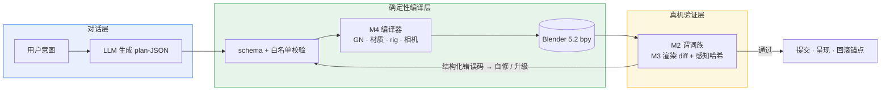

[English](README.md) | **简体中文**

<div align="center">

# Blender AI 建模控制台

**让 LLM 声明模型，而不是写脚本。**

*面向 Blender 的 plan–compile–verify 控制台：LLM 输出 plan-JSON，确定性编译器落到几何节点 / 材质 / 相机 / 角色 rig，机器 verifier 把守每一步。*

[](LICENSE)
[](https://www.blender.org/)
[](https://docs.blender.org/api/current/)
[](#验收状态)
[](https://github.com/master666-max/blender-ai-console/stargazers)

[核心创新](#核心创新) · [架构](#架构) · [快速开始](#快速开始) · [仓库结构](#仓库结构) · [验收状态](#验收状态) · [路线图](#路线图)

  

*同一只马克杯，三个连续的 plan 段落——杯身 → 挖空 → 把手——每段独立编译、独立验收。呈现帧（EEVEE、三点布光、procedural 木纹）：* 

</div>

---

## 核心创新

主流「AI + Blender」方案让 LLM 直接写并执行 bpy 脚本——能跑，但无法重放、无法审计、无法撤销。本项目换了一条路，且下面每一条主张都有库内实验或回归套件背书：

| # | 创新点 | 含义 | 实证 |
|---|---|---|---|
| 1 | **Plan–compile–verify 闭环** | LLM 永不产出可执行代码，只声明 **plan-JSON**——schema + 白名单校验（schema 外直接拒绝），由确定性编译器落地。 | Schema 门禁；29 套真机验收 ≈688 断言 |
| 2 | **零静默逃逸** | 编译失败是*响亮的*（adapter 校验抛错并回滚）；几何缺陷被机械 verifier 拦截（非流形 / 零面积 / 面预算 / 尺度）。EXP-1 的 11 个盲写样本中，**通过 verifier 的产物语义全部正确——0 例静默逃逸**。 | EXP-1 报告；EXP-7 门禁实验 |
| 3 | **契约质量是最高杠杆** | LLM 首版成功率的头号变量是 DSL 契约完整性：**补 4 行缺失文档，首版成功率 0% → 80%**。所以契约、错误码、schema 在本仓库是一等公民。 | EXP-1（n=11，同任务，盲写纪律） |
| 4 | **段落 = 三重边界** | 每个对话段落同时是执行单元、上下文压缩单元、回退单元：WAL + 哈希链、Step 可重放、revision + backdating、意图级 cascading 选择性撤销。 | Berlage '94 / Cass '06 谱系；M1 套件 |
| 5 | **同机位渲染 diff 作为地面真值** | 验证用固定机位 Workbench 渲染 + 感知哈希；呈现档（三点布光 + DOF）与 diff 管线两档并存——**每次渲染后恢复状态，互证 0 像素漂移**。 | M3 + M9-3 互证（dhash 一致） |
| 6 | **负结果也是交付物** | 失败的实验被沉淀为防坑资产：顶点指纹研究（Gear/FastCDC vs 全量重算）结论"不接入"并发现 Morton 薄层散射；Blender 5.2 移除 Delta Mush 后裁决 Corrective Smooth 替代。 | EXP-5（6/6）、EXP-7（3/3）、裁决台账 |

另有一条塑造全仓库的纪律：**上游隔离纪律**——第三方代码只吸收、不 import，来源全程可溯（见[致谢](#致谢)）。

## 架构



十个模块各带验收套件：**M1** 数据层（FlowDAG / WAL+哈希链 / Step 可重放）、**M2** 验证层（结构/渲染/BIM 谓词 + 分级门禁）、**M3** 渲染层（同机位 diff）、**M4** 编译层（GN / 材质含 procedural / Rigify rig）、**M5** 交互层（A/B 双编译）、**M6** 经验库（偏好学习 + EMD 离线标定）、**M7** 导演模式、**M8** 融合与发布工程、**M9** 对话前端、**M10** 静态 Web 控制台。

## 快速开始

```bash
git clone https://github.com/master666-max/blender-ai-console.git
cd blender-ai-console

# 真机验收（需 Blender 5.2 自带 Python / bpy）
python blender_console/m8r4_live.py     # 素材与呈现套件     20/20
python blender_console/m412b_live.py    # 角色管线集成       17/17

# Web 控制台自检（无需 Blender）
cd m9_web && node _selftest.mjs         # 42/42
```

纯 Python 单测（无 bpy 依赖）：`python blender_console/test_upstream_store.py`

全仓库路径均相对仓库根推导——不含任何机器相关的绝对路径。

## 仓库结构

| 路径 | 内容 |
|---|---|
| [`blender_console/`](blender_console/) | 控制台主体 + 29 套 `_live.py` 真机验收 |
| [`m8_bridge/gn_deploy/`](m8_bridge/gn_deploy/) | 部署载荷（55 py，与主线 diff 校验一致） |
| [`m9_web/`](m9_web/) | 静态 Web 控制台 + 闪烁 diff 查看器 |
| [`release/`](release/) | 发布 manifest（147 文件五层清单） |
| [`docs/img/`](docs/img/) | 本 README 使用的渲染帧 |
| [`上游隔离区/`](<上游隔离区/>) | 只读上游素材（机制库 / 工艺库）——只吸收、不 import |
| [`深度调研/`](深度调研/) · [`预调研/`](预调研/) · [`算法路线调研/`](算法路线调研/) | 支撑设计决策的学术预调研 |
| 工单 / 交接文档 / 进度规划 | 决策记录、验收口径、诚实缺口登记 |

## 验收状态

M1–M10 主线全绿；R7 深水区 AI 可做项收官。回归基线：**29 套 ≈ 688 断言**。

<details>
<summary><b>套件亮点（点击展开）</b></summary>

| 套件 | 覆盖 |
|---|---|
| `m8r4_live` 20/20 | Procedural 木纹编译 / 重放幂等 / 结构化拒绝 / 呈现档 + 0 漂移互证 |
| `exp5_live` 6/6 | 顶点指纹 A/B：Gear FastCDC 三路对照，判定"退回几何量指纹" |
| `m412b_live` 17/17 | 角色管线 console 集成 |
| `m412_live` 6/6 | rig 编译器，形变质量 IoU(128³) = 1.0 |
| `test_bim` 19/19 | BIM 谓词（数据级） |
| `exp7_live` 3/3 | 工艺门禁三组对照（左移效应） |
| `m6_live` 31/31 | AB → 偏好学习 / override 回写 / 多样性闸门 |
| 其余 20+ 套 | M1-M5 / M7 / M9 / M10 回归与冒烟 |

</details>

## 路线图

- [x] M1–M10 主线 + 发布反转（whl 2.1.0-gn 定版）
- [x] R7 深水区：角色管线（含 console 集成）/ EMD 标定 / BIM 谓词 / 材质素材 / 顶点指纹判定
- [ ] M9-5 闪烁 vs 并排偏好 A/B（flicker.html 已就绪，待真人实验）
- [ ] 远期：标注反查 · 声音通道 · HAMT · ARKit-52 表情 schema · 多 rig 共存

## 致谢

本项目站在以下工作的肩膀上：

- **[mcp-for-blender](https://github.com/ahujasid/blender-mcp)**（MIT，© 2025 Siddharth Ahuja）——传输层（沙箱 / 遥测 / 知情同意 / 配置模块）以 vendored 方式收录于 [`m8_bridge/brickfly_mcp_src/`](m8_bridge/brickfly_mcp_src/)，并在其上扩展了 8 个 GN 工具绑定；原许可声明保留于该目录的 [LICENSE](m8_bridge/brickfly_mcp_src/LICENSE)。
- **blender-mcp-skill v2.9.4**——同一作者的先行 skill 项目。其工艺库、机制片段与经验条目（EXP-001~014）经逐项人工审查后进入主线（思想优先，代码按审查判定吸收）；只读审查档案以逐字快照保留于 [`上游隔离区/`](<上游隔离区/>)——只吸收、不 import。
- **[Blender](https://www.blender.org/)** 与 bpy 社区——一切运行其上的地基。

## License

<div align="center">

[MIT](LICENSE) © 2026 · *以工程纪律对待每一个像素。*

</div>
