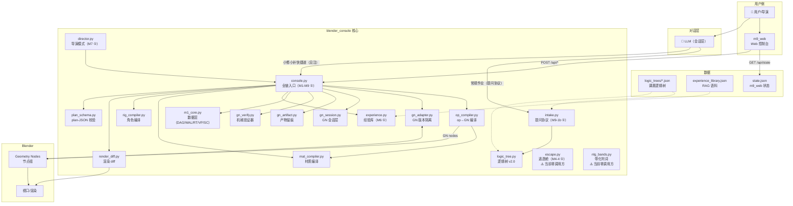
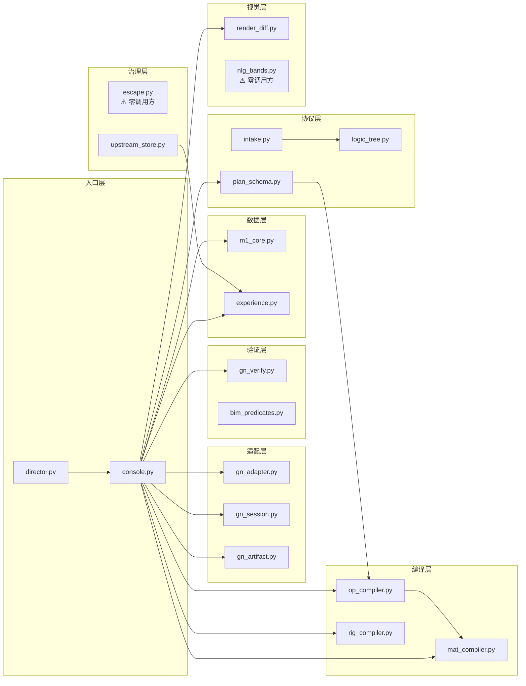
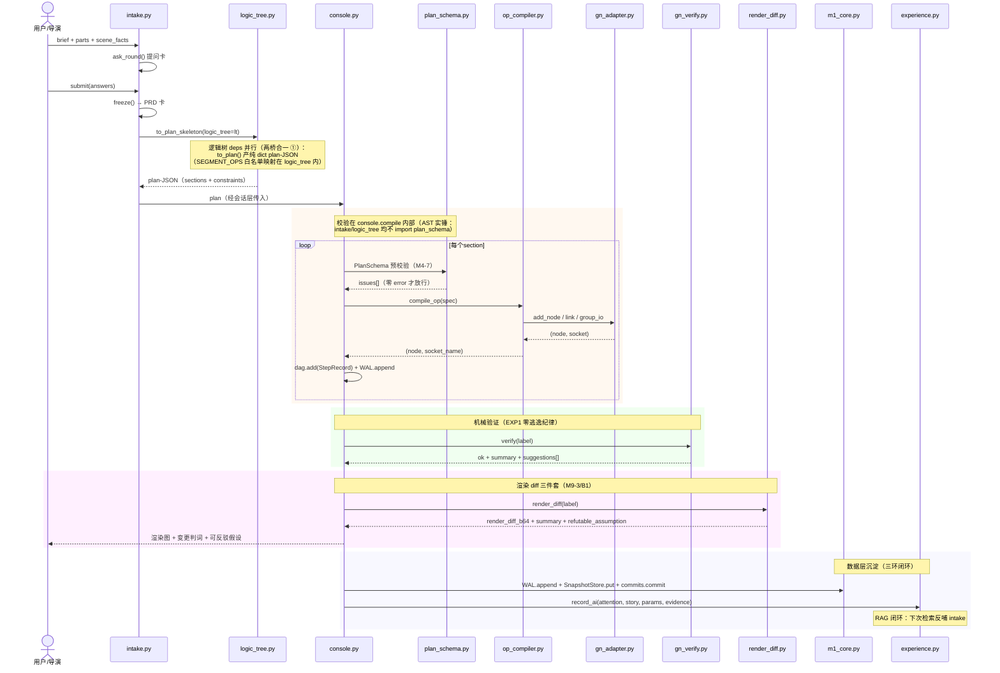
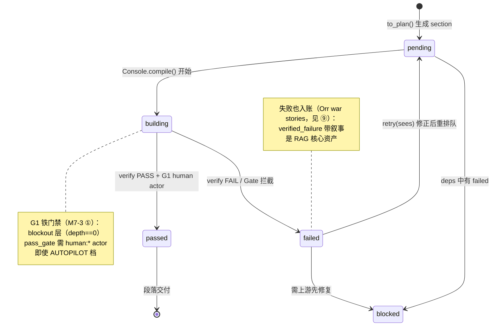
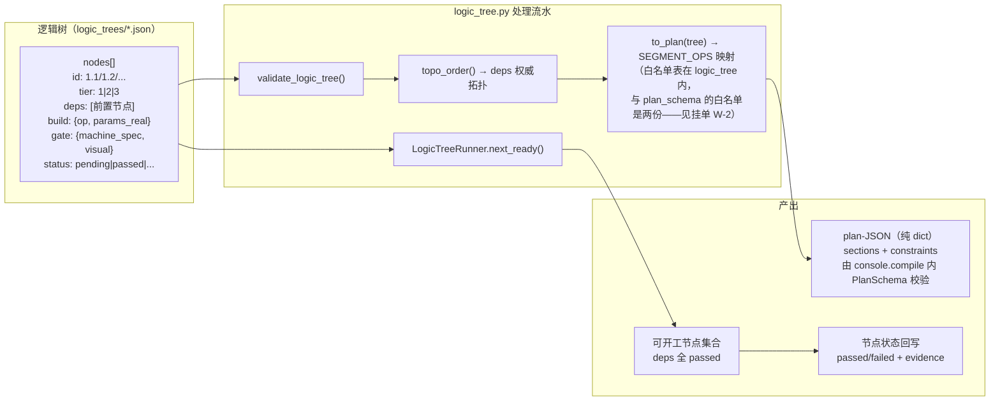
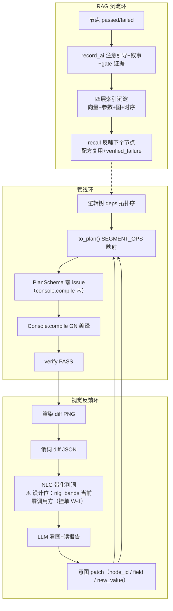
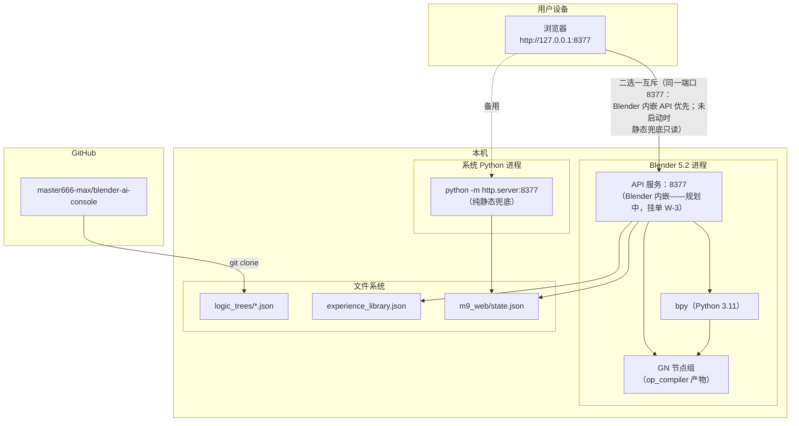

# blender_console 架构图集

> 图即代码——全部 Mermaid 格式，GitHub/GitLab 原生渲染，PR 可 diff。
> v2（2026-09-29）：按 AST 实测 import 重制，修 v1 的三处矛盾与假边。
>
> **方法学收口（回应 v1 验收）**：
> 1. **数据锚**：每张依赖图可由 `python docs/architecture/ast_deps.py` 复算——
>    import 关系以 AST 解析为准，**不手写**。改完代码跑一遍，diff 即图 diff。
> 2. **黑话词典**：见文末 ⑨——所有 M/A/EXP 编号在词典里有出处与一句话解释，
>    图内不再出现未收录的黑话；新黑话先入词典再上图。
> 3. **过期挂单**：见文末 ⑩——每张图有"数据锚命令 + 生成日期 + 过期判据"。
>    图与代码打架时，**以代码为准、图挂单重画**（过期图比没图害人）。

---

## ① 容器图（系统架构）

> **注（AI → CONSOLE 快捷道）**：常规建模作业必须走 `intake` 提问协议
> （brief→提问卡→冻结 PRD），保证 parts 覆盖率留痕。允许直连 `console` 的
> 仅限：对**已冻结 PRD 的会话**做小修小补（set_param / 重编译单段）——
> 不新开 parts、不改 scope。新作业从快捷道进来 = 绕过覆盖率门 = 违规。

---

## ② 模块依赖图（AST 静态解析，非手画）

**数据锚**：`python docs/architecture/ast_deps.py`（生成于 2026-09-29）。
只画核心生产模块；`*_live.py` 实验、`test_*.py`、probe 脚本不入图。

### 依赖规则（AST 实测，生成命令见数据锚）

| 被依赖方 | 被谁依赖（AST 实测） | 备注 |
|---|---|---|
| m1_core | console, gn_session | 数据层不反向依赖 ✓ |
| gn_adapter | console, gn_session, gn_ab | 适配层自包含 ✓ |
| gn_verify | console, gn_session, gn_ab | 验证器被两处复用 |
| gn_session | console | GN 会话组合层 |
| gn_artifact | console | 产物留痕 |
| op_compiler | console, **plan_schema** | plan_schema 反向 import 它取 SEGMENT_OPS 白名单 |
| mat_compiler | console, op_compiler | |
| rig_compiler | console | |
| plan_schema | console | **只此一家**（v1 表里的 intake/logic_tree 均实测不存在） |
| experience | console, upstream_store | |
| render_diff | console | |
| intake | _probe_intake_schema, m9_intake_live（实验脚本） | 核心模块暂无人 import 它——AI 会话层是它的运行时调用方 |
| logic_tree | intake（实测：intake import logic_tree） | **logic_tree 不 import plan_schema**——to_plan 产出纯 dict，校验在 console.compile 内 |
| director | exp7_live（实验脚本） | 运行时由 AI 会话层驱动 |

### v1 → v2 修正记录（验收裁决）

| v1 说法 | AST 裁决 | 修正 |
|---|---|---|
| 图② `LT --> PS` 假边 | logic_tree 不 import plan_schema | 删边 |
| 表：plan_schema 被 console, intake, logic_tree 依赖 | 只有 console | 改 |
| 注：logic_tree 不依赖 plan_schema | **正确** | 保留并升格为修正记录 |
| 时序图③ intake 调 PS 校验 | intake 不 import plan_schema；校验在 console.compile 内 | 改③ |
| op_compiler 依赖 gn_adapter | 实测不依赖 | 删 |
| plan_schema 依赖关系漏了它 import op_compiler | 实测 import（SEGMENT_OPS 白名单） | 补 |
| console 的 gn_session/gn_artifact 依赖没画 | 实测依赖 | 补 |

---

## ③ 时序图：建模作业全流程（intake → plan → compile → verify → render）

---

## ④ 状态机：段落生命周期

---

## ⑤ 逻辑树机制：节点转换流水

---

## ⑥ 数据流图：三环融合（管线 × 视觉 × RAG）

---

## ⑦ 部署图（运行时拓扑）

> **端口语义（v1 撞车修正）**：`8377` 同一端口**互斥启用**——Blender 内嵌
> API 服务是主（可写：compile/revert/set_param）；纯静态 http.server 是兜底
> （只读 state.json，供无 Blender 会话时看流程轴）。**不能同时跑**——
> 端口冲突时后者启动失败，属预期行为。

---

## ⑧ 维护策略

| 图 | 数据锚 | 更新触发 | 维护方式 |
|---|---|---|---|
| 容器图（①） | 无自动锚 | 架构变更时 | 手画（Mermaid） |
| 模块依赖图（②） | `ast_deps.py` | **每次 import 变更** | AST 实测 + diff |
| 时序图（③） | 无自动锚 | 流程变更时 | 手画（Mermaid） |
| 状态机（④） | logic_tree 状态枚举 | 新增状态时 | 手画（Mermaid） |
| 数据流图（⑥） | 无自动锚 | 三环接口变更时 | 手画（Mermaid） |
| 部署图（⑦） | server.py 实测 | 部署变更时 | 手画（Mermaid） |

渲染回归：`python docs/architecture/verify_mermaid.py` → 无头 Chrome 实渲染，
逐块 PASS/FAIL（mermaid 语法炸点在 PR 前拦住）。

---

## ⑨ 黑话词典（图内编号的唯一出处——新黑话先入词典再上图）

| 黑话 | 出处 | 一句话解释 |
|---|---|---|
| M1-M9 | 里程碑编号 | M1 数据层 / M2 验证 / M3 回退 / M4 编译器 / M5 实验对比 / M6 经验库 / M7 导演模式 / M8 变体 / M9 交互层 |
| M4-4 | escape.py | 逃逸舱：AI 直出 op-JSON 被 R12 拒绝时的人工审核逃生通道（禁 AI exec 代码） |
| M4-7 | console.compile 预校验 | 声明式契约校验：编译前拦 schema 违例（结构化错误带 suggestions） |
| M6-2b | experience.py | 免疫通道治理：AI 写入强制 draft，晋升必须过人（human:* promote） |
| M7-3 | logic_tree.py | G1 铁门禁 + sees 字段：blockout 层验收需 human:* actor；修正提案必须引用所见 |
| M9-1b | intake.py | 提问协议：brief → 提问卡 → 冻结 PRD，保证 parts 覆盖率留痕 |
| M9-3 / B1 | render_diff.py | 渲染 diff 三件套：图 + 变更判词 + 可反驳假设 |
| A1/A2 | WAL/快照修复 | 快照内容寻址落盘；restore_point 与 compaction 边界分离命名空间 |
| A14 | checkpoint | GoodPoint：mesh+params 快照，回退锚点 |
| A20 | gn_verify | 零逃逸纪律：门禁 + 响亮失败，不允许静默跳过验证 |
| 两桥合一 | intake ↔ logic_tree | to_plan_skeleton 接逻辑树参数：PRD 骨架与逻辑树 deps 并行段合并成一份 plan |
| SEGMENT_OPS | plan_schema / logic_tree | plan 段合法 op 白名单（两份表：schema 校验用 / logic_tree 映射用，见挂单 W-2） |
| G1 | logic_tree 状态机 | 铁门禁等级：blockout 层（deps 深度 0）强制人工验收 |
| Orr war stories | 人类学调研（6 组访谈） | 失败经验与成功经验同等核心资产——verified_failure 不衰减不过期 |
| 6 组人类学 | 大调研产出 | 六组跨学科调研中的人类学组：经验 = 注意引导 + 叙事（含失败），支撑经验库设计 |
| EXP1 | 实验记录 | 门禁+响亮失败=零静默逃逸实验：迭代杠杆 0%→80% |
| 三环 | 架构总纲 | 管线环 × 视觉反馈环 × RAG 沉淀环（图⑥） |
| verified_failure | experience.py | 机器门禁验证过的失败：AI 可凭谓词证据入账，status 仍 draft（晋升过人） |

---

## ⑩ 过期挂单（图与代码打架时：以代码为准，图挂单重画）

| 挂单 | 内容 | 判据（何时销单） |
|---|---|---|
| W-1 | **nlg_bands 零调用方**：⑥ 视觉反馈环的 B3（NLG 带化判词）是设计位，代码里还没有 RD→NLG 的调用 | gn_verify/console import nlg_bands 并在 verify/render 后产判词时销单，图②⑥补实边 |
| W-2 | **SEGMENT_OPS 两份白名单**：plan_schema.py 与 logic_tree.py 各维护一份 op 白名单，漂移风险 | 合并为单一真源（logic_tree 从 plan_schema import）时销单 |
| W-3 | **Web 控制台 API 层缺失**：console.html 调 /api/revert 等，但 server.py 纯静态；回退能力已真机验证（revert_live.py 13/13）但 HTTP 不通 | Blender 内嵌 API server（bpy.app.timers 主线程队列）落地时销单 |
| W-4 | **escape 零调用方**：M4-4 逃逸舱是治理关键件但核心链路无人 import（设计上由 AI 会话层显式走） | AI 会话层接线 escape 通道时销单，图①②补实边 |
| W-5 | **intake 核心模块无内部调用方**：只被实验脚本 import，运行时调用方是 AI 会话层（进程外） | 会话层代码入库时销单 |

> 挂单纪律：图上每个"⚠️/规划中/设计位"标记必须对应 ⑩ 里一行挂单；
> 挂单销单与图修改同一个 PR，不允许只改图不销单（或反之）。
