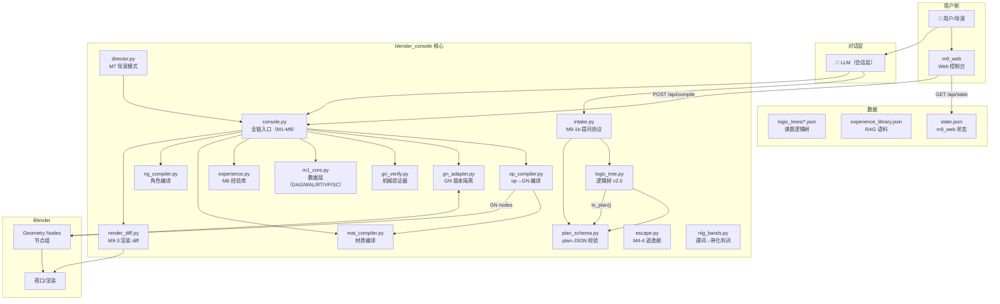
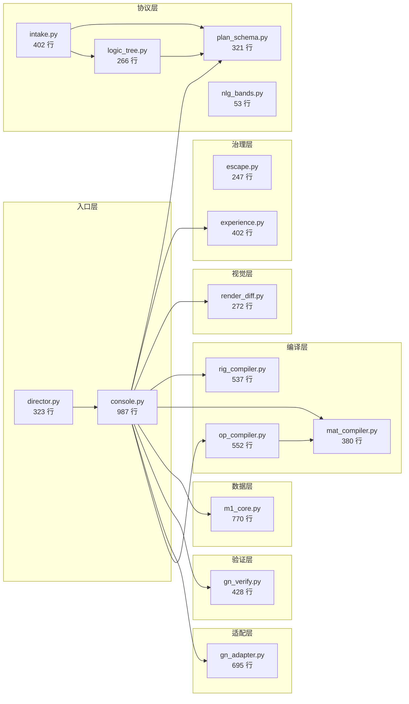
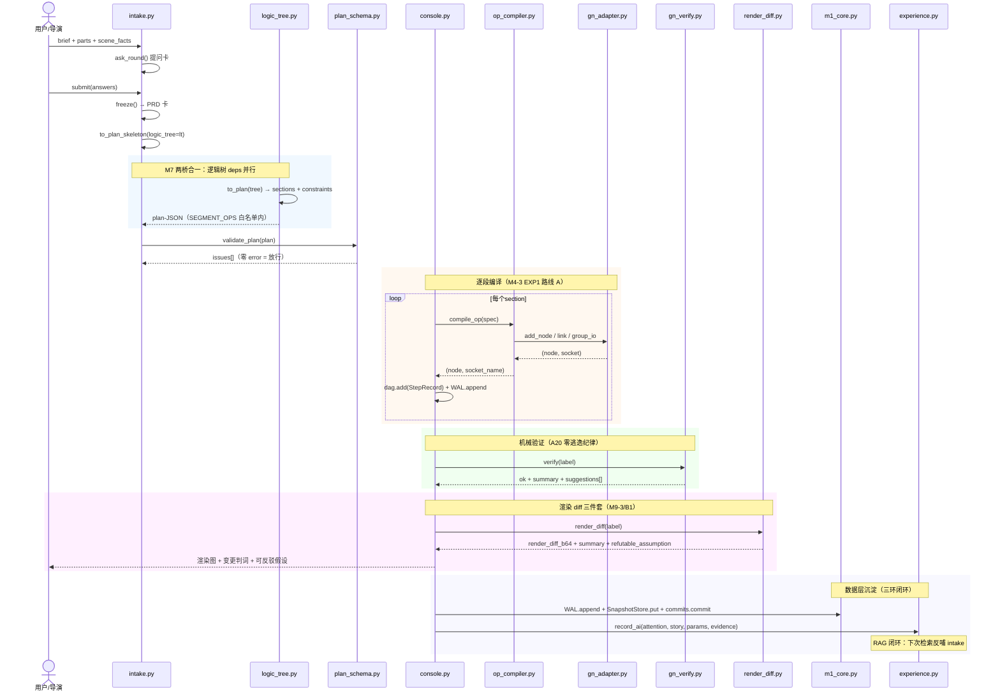
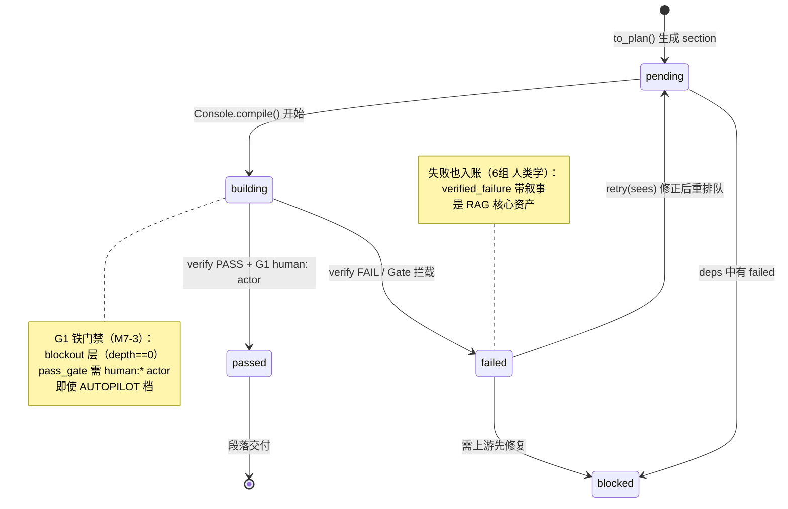
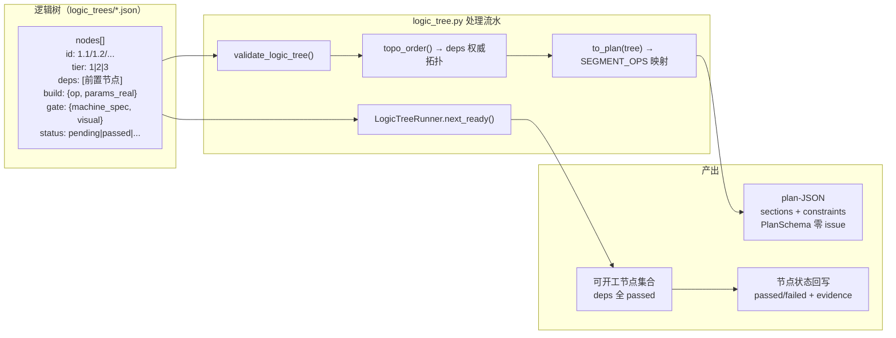
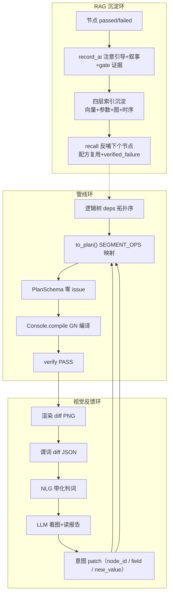
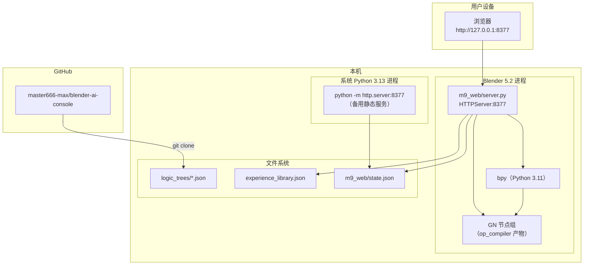

# blender_console 架构图集

> 图即代码——全部 Mermaid 格式，GitHub/GitLab 原生渲染，PR 可 diff。
> 生成日期：2026-09-28 | 数据来源：AST 静态解析（不手画）

---

## ① 容器图（系统架构）

---

## ② 模块依赖图（AST 静态解析，非手画）

### 依赖规则（从 import 语句 AST 解析，非手写）

| 被依赖方 | 被谁依赖 | 循环风险 |
|---|---|---|
| m1_core | console | 无（数据层不反向依赖） |
| gn_adapter | console, op_compiler | 无（适配层自包含） |
| op_compiler | console, mat_compiler | 无 |
| plan_schema | console, intake, logic_tree | 无 |
| experience | console | 无 |
| logic_tree | intake | 无（logic_tree 不依赖 plan_schema） |

---

## ③ 时序图：建模作业全流程（intake → plan → compile → verify → render）

---

## ④ 状态机：段落生命周期

---

## ⑤ 逻辑树机制：节点转换流水

---

## ⑥ 数据流图：三环融合（管线 × 视觉 × RAG）

---

## ⑦ 部署图（运行时拓扑）

---

## ⑧ 维护策略

| 图 | 更新频率 | 维护方式 |
|---|---|---|
| 容器图（①） | 架构变更时 | 手画（Mermaid） |
| 模块依赖图（②） | **每次 import 变更** | AST 自动生成 |
| 时序图（③） | 流程变更时 | 手画（Mermaid） |
| 状态机（④） | 新增状态时 | 手画（Mermaid） |
| 数据流图（⑥） | 三环接口变更时 | 手画（Mermaid） |
| 部署图（⑦） | 部署变更时 | 手画（Mermaid） |

**图即代码**：全部 Mermaid 文本放进仓库 `docs/architecture/` 目录，PR 里可 diff，十年后还能打开。
