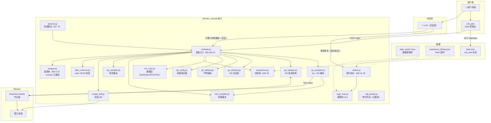
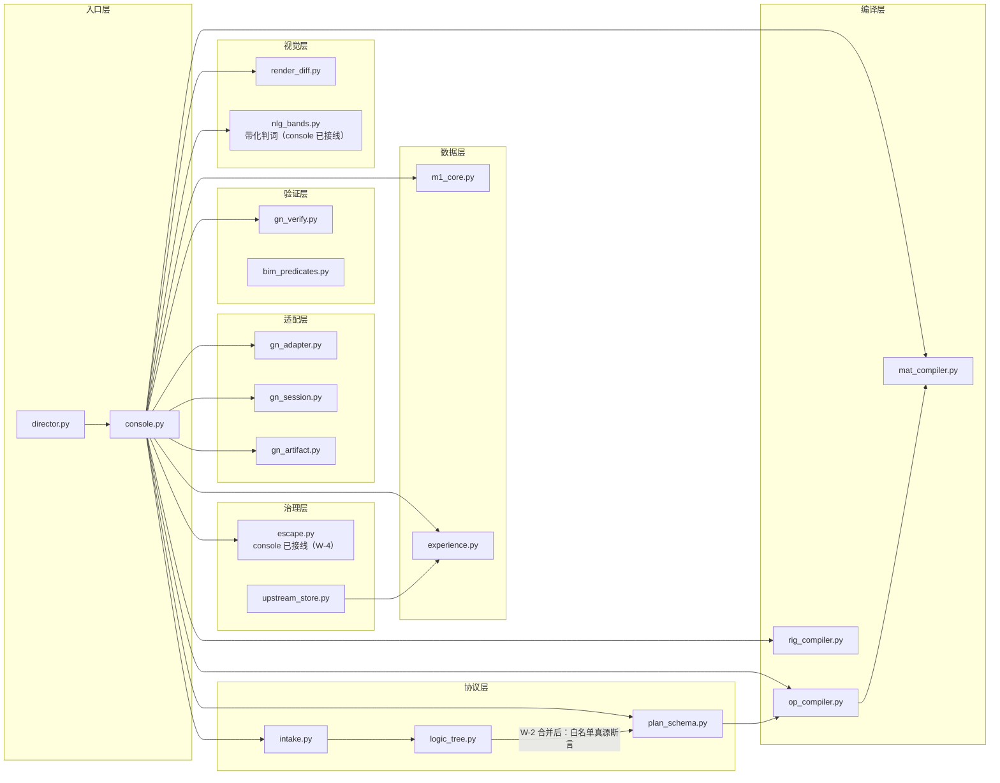
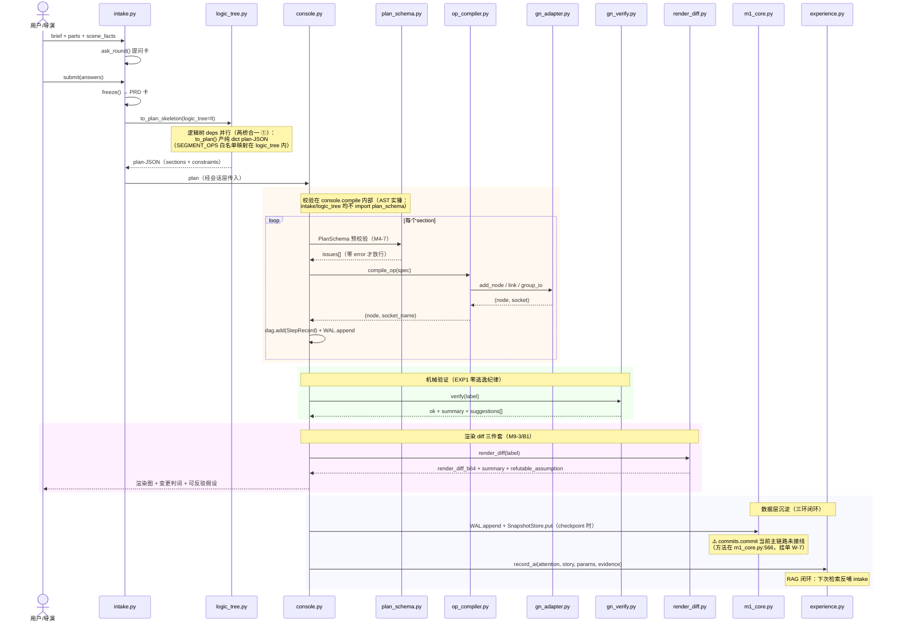
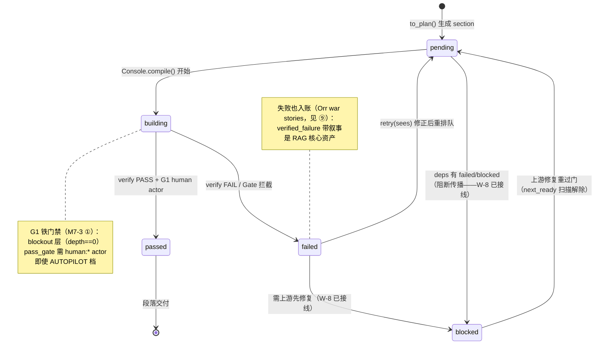
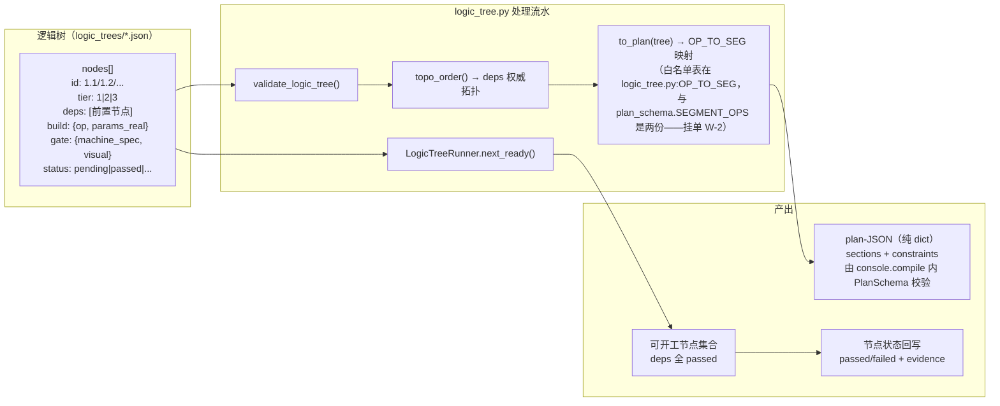
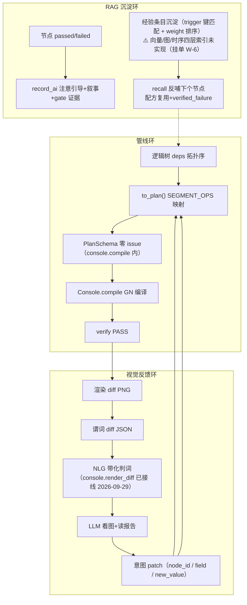
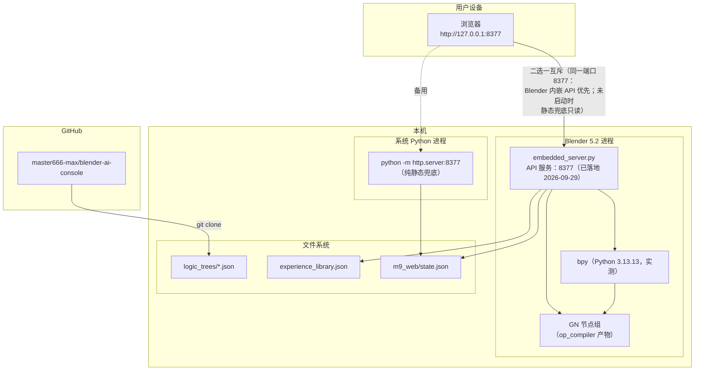

# blender_console 架构图集

> 图即代码——全部 Mermaid 格式，GitHub/GitLab 原生渲染，PR 可 diff。
> v2（2026-09-29）：按 AST 实测 import 重制，修 v1 的三处矛盾与假边。
>
> **方法学收口（回应 v1 验收）**：
> 1. **数据锚**：每张依赖图可由 `python docs/architecture/ast_deps.py` 复算——
>    import 关系以 AST 解析为准，**不手写**。改完代码跑一遍，diff 即图 diff。
> 2. **黑话词典**：见文末 ⑨——所有 M/A/EXP 编号在词典里有出处与一句话解释，
>    图内不再出现未收录的黑话；新黑话先入词典再上图。
> 3. **过期挂单**：见文末 ⑩——每张图有"数据锚命令 + 生成日期 + 过期判据"。
>    图与代码打架时，**以代码为准、图挂单重画**（过期图比没图害人）。

---

## ① 容器图（系统架构）

> **注（AI → CONSOLE 快捷道）**：常规建模作业必须走 `intake` 提问协议
> （brief→提问卡→冻结 PRD），保证 parts 覆盖率留痕。允许直连 `console` 的
> 仅限：对**已冻结 PRD 的会话**做小修小补（set_param / 重编译单段）——
> 不新开 parts、不改 scope。新作业从快捷道进来 = 绕过覆盖率门 = 违规。

---

## ② 模块依赖图（AST 静态解析，非手画）

**数据锚**：`python docs/architecture/ast_deps.py`（生成于 2026-09-29）。
只画核心生产模块；`*_live.py` 实验、`test_*.py`、probe 脚本不入图。

### 依赖规则（AST 实测，生成命令见数据锚）

| 被依赖方 | 被谁依赖（AST 实测） | 备注 |
|---|---|---|
| m1_core | console, gn_session | 数据层不反向依赖 ✓ |
| gn_adapter | console, gn_session, gn_ab | 适配层自包含 ✓ |
| gn_verify | console, gn_session, gn_ab | 验证器被两处复用 |
| gn_session | console | GN 会话组合层 |
| gn_artifact | console | 产物留痕 |
| op_compiler | console, **plan_schema** | plan_schema 反向 import 它取 SEGMENT_OPS 白名单 |
| mat_compiler | console, op_compiler | |
| rig_compiler | console | |
| plan_schema | console | **只此一家**（v1 表里的 intake/logic_tree 均实测不存在） |
| experience | console, upstream_store | |
| render_diff | console | |
| intake | _probe_intake_schema, m9_intake_live（实验脚本） | 核心模块暂无人 import 它——AI 会话层是它的运行时调用方 |
| logic_tree | intake（实测：intake import logic_tree）＋ plan_schema（**W-2 合并后新增**：白名单真源断言） | ~~logic_tree 不依赖 plan_schema~~ 已过时——W-2 合并后有受控依赖（值域断言） |
| director | exp7_live（实验脚本） | 运行时由 AI 会话层驱动 |

### v1 → v2 修正记录（验收裁决）

| v1 说法 | AST 裁决 | 修正 |
|---|---|---|
| 图② `LT --> PS` 假边 | logic_tree 不 import plan_schema | 删边 |
| 表：plan_schema 被 console, intake, logic_tree 依赖 | 只有 console | 改 |
| 注：logic_tree 不依赖 plan_schema | **正确** | 保留并升格为修正记录 |
| 时序图③ intake 调 PS 校验 | intake 不 import plan_schema；校验在 console.compile 内 | 改③ |
| op_compiler 依赖 gn_adapter | 实测不依赖 | 删 |
| plan_schema 依赖关系漏了它 import op_compiler | 实测 import（SEGMENT_OPS 白名单） | 补 |
| console 的 gn_session/gn_artifact 依赖没画 | 实测依赖 | 补 |

---

## ③ 时序图：建模作业全流程（intake → plan → compile → verify → render）

---

## ④ 状态机：段落生命周期

---

## ⑤ 逻辑树机制：节点转换流水

---

## ⑥ 数据流图：三环融合（管线 × 视觉 × RAG）

---

## ⑦ 部署图（运行时拓扑）

> **端口语义（v1 撞车修正）**：`8377` 同一端口**互斥启用**——Blender 内嵌
> API 服务是主（可写：compile/revert/set_param）；纯静态 http.server 是兜底
> （只读 state.json，供无 Blender 会话时看流程轴）。**不能同时跑**——
> 端口冲突时后者启动失败，属预期行为。

---

## ⑧ 维护策略

| 图 | 数据锚 | 更新触发 | 维护方式 |
|---|---|---|---|
| 容器图（①） | 无自动锚 | 架构变更时 | 手画（Mermaid） |
| 模块依赖图（②） | `ast_deps.py` | **每次 import 变更** | AST 实测 + diff |
| 时序图（③） | 无自动锚 | 流程变更时 | 手画（Mermaid） |
| 状态机（④） | logic_tree 状态枚举 | 新增状态时 | 手画（Mermaid） |
| 数据流图（⑥） | 无自动锚 | 三环接口变更时 | 手画（Mermaid） |
| 部署图（⑦） | server.py 实测 | 部署变更时 | 手画（Mermaid） |

渲染回归：`python docs/architecture/verify_mermaid.py` → 无头 Chrome 实渲染，
逐块 PASS/FAIL（mermaid 语法炸点在 PR 前拦住）。

**链路回归门禁（2026-09-29 起）**：改 `op_compiler.py` / `console.py` /
`logic_tree.py` 结构后必须跑 `blender --background --python e2e_live.py`
（九步全链 11/11）——图③⑥画的是链路行为，锚点就是这条脚本。

---

## ⑨ 黑话词典（图内编号的唯一出处——新黑话先入词典再上图）

| 黑话 | 出处 | 一句话解释 |
|---|---|---|
| M1-M9 | 里程碑编号 | M1 数据层 / M2 验证 / M3 回退 / M4 编译器 / M5 实验对比 / M6 经验库 / M7 导演模式 / M8 变体 / M9 交互层 |
| M4-4 | escape.py | 逃逸舱：AI 直出 op-JSON 被 R12 拒绝时的人工审核逃生通道（禁 AI exec 代码） |
| M4-7 | console.compile 预校验 | 声明式契约校验：编译前拦 schema 违例（结构化错误带 suggestions） |
| M6-2b | experience.py | 免疫通道治理：AI 写入强制 draft，晋升必须过人（human:* promote） |
| M7-3 | logic_tree.py | G1 铁门禁 + sees 字段：blockout 层验收需 human:* actor；修正提案必须引用所见 |
| M9-1b | intake.py | 提问协议：brief → 提问卡 → 冻结 PRD，保证 parts 覆盖率留痕 |
| M9-3 / B1 | render_diff.py | 渲染 diff 三件套：图 + 变更判词 + 可反驳假设 |
| A1/A2 | WAL/快照修复 | 快照内容寻址落盘；restore_point 与 compaction 边界分离命名空间 |
| A14 | checkpoint | GoodPoint：mesh+params 快照，回退锚点 |
| A20 | gn_verify | 零逃逸纪律：门禁 + 响亮失败，不允许静默跳过验证 |
| 两桥合一 | intake ↔ logic_tree | to_plan_skeleton 接逻辑树参数：PRD 骨架与逻辑树 deps 并行段合并成一份 plan |
| SEGMENT_OPS | plan_schema / logic_tree | plan 段合法 op 白名单（两份表：schema 校验用 / logic_tree 映射用，见挂单 W-2） |
| G1 | logic_tree 状态机 | 铁门禁等级：blockout 层（deps 深度 0）强制人工验收 |
| Orr war stories | 人类学调研（6 组访谈） | 失败经验与成功经验同等核心资产——verified_failure 不衰减不过期 |
| 6 组人类学 | 大调研产出 | 六组跨学科调研中的人类学组：经验 = 注意引导 + 叙事（含失败），支撑经验库设计 |
| EXP1 | 实验记录 | 门禁+响亮失败=零静默逃逸实验：迭代杠杆 0%→80% |
| 三环 | 架构总纲 | 管线环 × 视觉反馈环 × RAG 沉淀环（图⑥） |
| verified_failure | experience.py | 机器门禁验证过的失败：AI 可凭谓词证据入账，status 仍 draft（晋升过人） |

### ⑨b 理论出处（PARC 实践学派——verified_failure 的世界观来源）

> verified_failure 不是孤立灵感，而是把 PARC"认知在实践中学派"的内核
> 搬进 AI 记忆系统的一次落地。三本原著 + 一本同门，2026-09-29 收录：

| 出处 | 核心命题 | 在本项目中的对应物 |
|---|---|---|
| Orr《Talking About Machines》(1996) | 战争故事是诊断知识的一级载体；诊断=把零散信息拼成连贯叙述；故事在社群中的流通承载现场机器行为新细节 | record_ai(attention, story, params, evidence)；verified_failure 不衰减不过期；render_diff 的 refutable_assumption（比原命题更进一步：叙事必须可证伪） |
| Suchman《Plans and Situated Actions》(1987) | 人并不执行计划——计划只是情境行动的资源，不是指令脚本 | 逻辑树+意图 patch 可改写计划（半尊重）；PlanSchema"零 error 放行"仍是"计划=合同"心智（待搬，见 W-14） |
| Lave & Wenger《Situated Learning》(1991) | 合法边缘参与：学习=在实践社群中从边缘走向中心 | verified_failure 的 draft → human:* promote 两段制（AI 只能写边缘草稿，晋升是走向中心） |
| Hutchins《Cognition in the Wild》(1995) | 认知分布于系统而非头脑（distributed cognition） | 三环架构的认识论地基：诊断能力不在任何一个模块里，在管线×视觉×RAG 的循环里 |
| **现代回声**：Reflexion（NeurIPS 2023，HumanEval pass@1 80.1%→91.0%） | agent 失败后产出一段**口头诊断**、存入 episodic buffer、带它进下一次尝试 | **剥掉了社群的战争故事**：agent 自言自语、任务结束即丢弃。verified_failure 是它的制度化升级——从**情景记忆**（私有、易逝）到**社群记忆**（共享、人门晋升、不衰减不过期）；这正是 Orr 笔下"技师个人记忆"与"社群故事库"的那道分界（→ W-9）|

---

## ⑩ 过期挂单（图与代码打架时：以代码为准，图挂单重画）

| 挂单 | 内容 | 判据（何时销单） |
|---|---|---|
| ~~W-1~~ | ~~nlg_bands 零调用方~~ | **已销单（2026-09-29）**：console.render_diff 接线 verdict_report（AST 实证 console import nlg_bands），E2E 九步链（e2e_live.py 11/11）判词驱动 patch 两轮收敛实证；图②⑥已补实边 |
| W-2 | ~~两份 op 白名单~~ | **已销单（2026-09-29）**：logic_tree.py import plan_schema.SEGMENT_OPS 并模块加载即断言 OP_TO_SEG 值域 ⊆ 白名单（漂移在 import 时响亮失败）。连锁更新：图② `LT --> PS` 从 v1 假边变成受控真边——"图随代码"的完整闭环案例 |
| ~~W-3~~ | ~~Web 控制台 API 层缺失~~ | **已销单（2026-09-29）**：embedded_server.py 落地——HTTP daemon 线程 + 队列 + 主线程泵（GUI=bpy.app.timers / 后台脚本=manual pump 双模式）；api_revert_live.py 真机 14/14（state/checkpoint/revert/pop/drop_segment/verify/override/UNKNOWN_OP/静态伺服/无死锁）。销单动作：部署图 ⑦ 同步更新 |
| ~~W-4~~ | ~~escape 零调用方~~ | **已销单（2026-09-29）**：console 接线 EscapeHatch——`escape_run_template`（L2 模板）/`escape_run_script`（L3 域白名单 AST 审查+human:* 审核标记，执行权留在宿主）；AST 实证 escape ← console；test_wiring 18/18 |
| ~~W-5~~ | ~~intake 核心模块无内部调用方~~ | **已销单（2026-09-29）**：console 接线 IntakeSession——`start_session/ask_round/submit/freeze` 四方法门面（会话层只调 console 一个入口）；AST 实证 intake ← console；test_intake 22/22 |

| W-6 | ~~四层索引未实现~~ **图索引+参数分布索引已落地（2026-09-29）**：`_graph`（trigger 键值→eids，`related()` 一跳邻域）/`_pidx`（params@量级桶，`recall_by_param()`），add/load 增量维护重启重建；test_wiring 行为验证。**遗留**：向量层（需 embedding 外部基建）——不销单 | 图层/参数层销单；向量层待基建 |
| ~~W-9~~ | ~~故事存活率索引~~ **完全销单（2026-09-29）**：recall 命中自动计数 recall_hits + survival_rate 评分信号 + _compute_kpis 输出 experience 统计（entries/draft/verified/avg_survival）——评分信号已可被会话层/前端直接消费；与 W-6 图索引互补（存活率=流通层） |
| ~~W-7~~ | ~~commits.commit 主链路未接线~~ | **已销单（2026-09-29）**：console.compile 成功即 `commits.commit(seg, vparams快照, "fp:"+fingerprint, deps)`（内容寻址自动去重，revert/set_param 重编译产出新 hash）；E2E 实证 export_state.commits 五段全 hash |
| W-8 | ~~blocked 幽灵状态~~ **已销单（2026-09-29）**：next_ready 扫描落地——pending+deps(failed/blocked) → blocked（阻断传播），blocked+deps 全 passed → 解除回 pending；evidence 留痕 BLOCKED/UNBLOCKED；test_logic_tree [10] 4 断言；图④ 补三条转移 |
| ~~W-9~~ | ~~故事存活率索引~~ **完全销单（2026-09-29）**：recall 命中自动计数 recall_hits + survival_rate 评分信号 + _compute_kpis 输出 experience 统计——评分信号可被会话层/前端直接消费；与 W-6 图索引互补（存活率=流通层） |
| ~~W-10~~ | ~~共享词汇卡未提供~~ | **已销单（2026-09-29）**：intake.py `vocab_card()` 挂在 ask_round 卡上——11 词条（segment/gate/G1/blockout/tier/set_param/patch/GoodPoint/revert/verified_failure/draft-promote），test_intake 22/22 |
| W-11 | ~~失败工件考古接口缺失~~ **基础版销单（2026-09-29）**：console.archaeology()——遍历 WAL 收集 recompile/drop_segment/drop_part/override，按 seg 分组统计高危区（确定性共性解读）；真机实证 1 件丢弃物→高危区 [('B',1)]。**遗留**：失败分支 GN 状态快照（重量级）待 gn_artifact 扩展 |
| ~~W-12~~ | ~~owner-session 与无主工件防毒~~ | **已销单（2026-09-29）**：ExperienceEntry.owner 字段 + record_ai/record_override 自动落账（ai:ai-channel / user-override）+ recall 防毒过滤器（无主件不可召回）+ from_dict 迁移（存量 → legacy:pre-W12 有主）；test_experience [7c] 4 断言（54/54）。安全属性落地 |
| ~~W-13~~ | ~~引用债/互惠网络~~ **基础版销单（2026-09-29）**：ExperienceEntry.credits_to 字段 + record_credit 记账 + debt_report（债主榜+在还的债）+ record_ai(credits_to=) 直写；test_wiring 行为验证。**遗留**：多会话运行时（跨会话互惠）待宿主编排——库内数据层已就绪 |
| ~~W-14~~ | ~~plan 修订未入库为一级事件~~ **完全销单（2026-09-29）**：note_plan_revision 通道 + set_param 几何变化自动触发（changed=True 即入库，库未激活静默跳过——缺省通路零依赖）。Suchman"计划是资源"的落地完成 |

> **重复挂单防护（2026-09-29 核对实录）**：Orr/PARC 学派那一批吸收件（故事地位经济学／共享词汇卡／垃圾桶原则／领地与孤机／互惠网络／Suchman 哲学底座）**已在案为 W-9~W-14 + ⑨b**；同日另有一份同源分析（追溯到同一批原著）若再次流入，**只许补增量、不许另起编号**。
>
> 挂单纪律：图上每个"⚠️/规划中/设计位"标记必须对应 ⑩ 里一行挂单；
> 挂单销单与图修改同一个 PR，不允许只改图不销单（或反之）。
