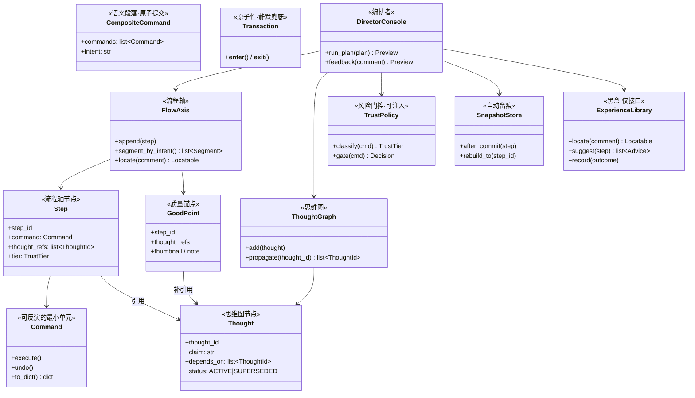

# 六问理解：从「可观测性」到「导演模式」

> 背景：你在原对话里提了六个问题，对方只正面回应了第 6 条（批评成立 → 转向导演模式）。
> 本文档记录我对**全部六问**的理解，以及我认为那份回答漏掉的前提。

---

## 零、总判断：这不是六个问题，是一个问题的六个切面

六个问题指向同一个矛盾：

> **AI 越强（跑得越快、越自主），人越看不懂它在干嘛；人越看不懂，就越不敢放手；越不敢放手，就越要逐条审批；越审批，AI 的速度优势归零。**

拆开看，六问正好落在三个层次上：

| 层次 | 回答的问题 | 对应题号 | 本质 |
|---|---|---|---|
| **看得见** | 它做了什么？为什么这么做？以前怎么做过？ | 一、二、三 | **可观测性** |
| **回得去** | 搞砸了怎么办？怎么越用越强？ | 四、五 | **可持续性** |
| **管得松** | 人该在哪儿介入？ | 六 | **交互成本** |

**关键结论：六不是对前五的否定，而是前五的验收标准。**

那份回答的逻辑是「回退便宜了 → 审查不该昂贵」，这没错。但它跳过了前面的链条：

```
可观测性  →  信任  →  敢放手  →  速度  →  迭代次数  →  最终质量
(一二三)         (六)                              (第一性原理)
```

**没有流程轴和思维图，「导演」看的是一串渲染图，根本没有介入点。** 你喊了 cut，然后呢？回退到上一面旗，然后呢？改哪个参数、推翻哪个假设？不知道。

> **「管得松」的资格，是「看得见 + 回得去」换来的。**
> 导演模式不该是删掉前五条，而应该是前五条建好之后自动涌现的结果。

---

## 一、第 1 问：如何结合「特殊」向量库 + 随时返回某一步

### 1.1 「特殊」在哪——我理解你问的不是选型

Blender 的操作数据有四点和普通文本语料不一样，决定了它**不能只用一个向量库**：

| 特殊性 | 后果 | 需要什么索引 |
|---|---|---|
| **代码是结构化的**，不是自然语言 | 纯 embedding 召回差，`primitive_cube_add` 和 `primitive_uv_sphere_add` 向量距离极近但语义完全不同 | **混合检索**：BM25（代码字面）+ 向量（NL 描述） |
| **几何语义无法文本化** | "把手太粗了"这种反馈，向量库里根本没有"粗细"这个维度，检索不到 | **参数索引**：记录每个 op 的参数维度 + 取值范围，支持按参数反查 |
| **上下文强依赖** | 同一个"挤出"，在立方体和在圆柱上意义完全不同 | **状态指纹**：每条记录带前置拓扑哈希 |
| **时序/依赖** | 操作不是独立文档，有严格前序关系 | **图索引**（这直接引出第 2 问） |

**结论：所谓"特殊向量库" = 向量（语义）+ 参数索引（结构化）+ 图（依赖）+ 时序（版本）的四层混合索引。** 单一向量库答不了 `bpy.ops` 的检索。

### 1.2 随时返回某一步 ≠ 回退到 step 编号

你说的"随时返回某一步骤，达到 AI 与人深度协作"——我理解关键词在**后半句**。

- 如果只是"回到 step_137"，那是个**版本控制功能**，Git 就够了，不值得单独做。
- 你真正要的是：**人指着某个状态说"从这里改"，AI 能接上上下文继续跑**。

这需要回退的粒度分三档，只有第三档才叫"深度协作"：

| 档位 | 回退到 | 人说什么 | AI 能做什么 |
|---|---|---|---|
| L1 状态回退 | 某个快照 | "回到第 20 步" | 恢复场景，仅此而已 |
| L2 语义回退 | 某个 GoodPoint | "回到比例对的那版" | 恢复 + 知道这版**好在哪** |
| L3 **意图回退** | 某个 Thought | "这个假设不对" | 恢复 + 推翻假设 + **重新推导后续所有步骤** |

**L3 才是你要的深度协作**，它要求第 3 问的思维图必须存在——因为回退的对象不是代码，是**决策**。

---

## 二、第 2 问：图检索 / LightRAG + 流程轴 + 控制台

### 2.1 为什么必须要图——向量库答不了的三类问题

| 问题 | 向量库 | 图 |
|---|---|---|
| "类似的倒角怎么做过？" | ✅ 语义相似 | ✅ |
| "这个倒角是在哪个基元上做的？" | ❌ | ✅ 依赖边 |
| "哪一步引入了这个破面？" | ❌ | ✅ 反向追溯 |
| "改这个尺寸会影响哪些下游步骤？" | ❌ | ✅ 影响面传播 |

后三问才是建模过程中真正高频的。**向量库管"像不像"，图管"连不连"。**

### 2.2 LightRAG：能用，但别照抄

LightRAG 的价值是**自动化实体-关系抽取**。但对 Blender 有个更优解：

> ⚠️ **LightRAG 是为非结构化文本设计的，让 LLM 从代码里"抽"实体关系是浪费。**
> `bpy.ops` 代码是**天然结构化的** —— 直接 parse AST / 读 RNA 反射就能拿到「操作 → 对象 → 参数 → 依赖」的完整图，**零 LLM 成本、零抽取错误**。

**结论：图的部分用代码解析建（确定性），NL 描述的部分用 LLM 补（语义层）。两条路合一。** 这是相比直接上 LightRAG 的关键改良。

### 2.3 流程轴（FlowAxis）是什么

我理解你要的不是一个"日志列表"，而是一条**可扫视、可定位、可下钻的时间线**：

```
T0 ─── T1 ─── T2 ═══ T3 ─── T4 ┈┈┈ T5 ─── T6
│       │      ║      │       ┊      │
│       │      ║      │       ┊      └─ 🚩 GoodPoint "比例对了"
│       │      ║      │       └─ ⚠️ Tier2 破坏性（这里有刀）
│       │      ║      └─ 💡 AI 建议（非阻塞，可采纳）
│       │      ║
│       │      ══ 思维图锚点：Thought T2「把手直径 22mm 舒适」
│       └─ step_15 extrude scale=(1.2,1.2,1)
└─ Thought T1「日式风格 → 圆角过渡」
```

**三个设计要点**：
1. **不是每一步都展开** —— 按"语义段落"折叠（一段 = 一个意图），人扫段落不扫步骤
2. **破坏性步骤高亮而非拦截** —— 同意那份回答的做法，事前拦截成本比事后回退高一个数量级
3. **每个段落挂一个 Thought 锚点** —— 这是流程轴和思维图的接缝（第 3 问）

### 2.4 控制台的定位

我理解"控制台"不是"聊天框 + 执行按钮"，而是**三个视图共用一套状态**：

| 视图 | 回答 | 人的动作 |
|---|---|---|
| **流程轴** | 做了什么 | 扫视、定位、点旗 |
| **思维图** | 为什么 | 质疑假设、改前提 |
| **视口/渲染** | 现在什么样 | 审美判断 |

**三视图联动**是控制台的真正价值：点流程轴上一步 → 视口跳到那个状态 → 思维图高亮对应 thought。做到了这个，人才可能"只在段落边界看一眼"。

---

## 三、第 3 问：思维图（ThoughtGraph）

### 3.1 思维图 ≠ 流程轴的细化，是正交的另一个维度

这点必须分清，很多方案在这里混淆：

| | 流程轴 FlowAxis | 思维图 ThoughtGraph |
|---|---|---|
| 回答 | **What**（发生了什么） | **Why**（为什么） |
| 结构 | 线性 / 有向序列 | 有向图（推导、反驳、替代） |
| 粒度 | 操作级（一个 bpy.ops） | 决策级（一个假设/判断） |
| 节点 | Step | Thought（假设 / 依据 / 结论 / 被推翻项） |
| 来源 | 执行日志 | AI 推理过程的显式外化 |

**映射关系是 `Step ⇄ Thought`：多对多。** 一个 thought 支撑多个 step，一个 step 可能同时服务于两个 thought。

### 3.2 思维图的真正用途：把「定位粒度」从参数层提升到假设层

这是我认为**那份回答最关键的缺口**。它给的 `_locate` 例子：

```
"把手太粗了" → 定位到 step_15（挤出的 scale 参数）
```

这只是**修一次**。而：

```
"把手太粗了" → 定位到 Thought T2（"直径 22mm 舒适"这个假设）
```

这是**修一类** —— 改了假设，AI 会重新推导所有依赖这个假设的步骤（把手直径、握位弧度、连接处过渡……）。

| 定位粒度 | 人的话 | AI 改什么 | 影响范围 |
|---|---|---|---|
| 参数层 | "粗了" | 改 scale 值 | 1 步 |
| **假设层** | "粗了" | 推翻并重推 | 所有下游依赖步 |

**假设层定位才是"深度协作"的定义。** 而它要求思维图里的 thought 必须带上**依赖关系**（哪些 thought 依赖它）。

### 3.3 一个警告

思维图不要做成"AI 自言自语的完整 CoT 导出"——人会淹死。**只外化「可争议的假设」**：AI 自己拍的判断、没有硬依据的选择、有多种合理走向的分叉。确定性的推导不用给人看。

---

## 四、第 4 问：深化可持续 + AI 建议

### 4.1 可持续是三层，不只是"能回退"

| 层 | 含义 | 载体 | 缺了会怎样 |
|---|---|---|---|
| **状态可持续** | 能回到任意时刻 | 快照 / delta | 搞砸了没法救 |
| **语义可持续** | 知道那时**为什么**是这样 | 思维图 + GoodPoint.note | 回到去了也不知道好在哪 |
| **能力可持续** | 系统越用越强 | 经验库（你说不用管，只留接口） | 同样的错反复犯 |

**第二层是那份回答做得不够的地方**：它的 `GoodPoint` 只记了 `thumbnail + note`，**没记 thought 引用**。所以回退到旗子后，AI 只知道"这版好看"，不知道"这版基于什么假设"——下次重跑还会犯同样的错。

修正很简单：

```python
@dataclass(frozen=True)
class GoodPoint:
    step_id: StepId
    thought_refs: tuple[ThoughtId, ...]   # ← 补这个
    thumbnail: str
    note: str
    created_at: str
```

有了 `thought_refs`，GoodPoint 就从"一个截图"变成"**一个可复用的决策包**"。

### 4.2 AI 建议的正确形态：非阻塞挂载

按你的第 6 问精神（别打断），AI 建议绝不能是弹窗或中断。**它是挂在流程轴上的候选节点**：

```
── T4 ─── 💡(建议: 这里加个倒角会更自然) ─── T5 ───
              ↑ 人扫视时看到，点一下采纳，不点就无视
```

三个约束：
1. **不阻塞执行** —— AI 一边跑一边挂建议
2. **可批量采纳** —— 人可以说"这几条都采纳"
3. **采纳与否回写经验库** —— 这是唯一需要反馈的地方，成本极低（顺手一点）

---

## 五、第 5 问：全程 OOP

我理解你说的不是"用 class 写代码"这种表层要求，而是：

> **整个系统必须建模成一组职责边界清晰、生命周期明确的对象，而不是一堆脚本 + 全局状态。**

而且这个要求和"可回退 / 可观测"是**同构**的：

| 能力 | 对应的对象性质 |
|---|---|
| 可回退 | `Command` 必须**可反演**（有 `undo()`） |
| 可观测 | `Step` 必须**可序列化**（能上流程轴） |
| 可追溯 | `Thought` 必须**可引用**（能被 GoodPoint 锚定） |
| 可换策略 | `Policy` 必须**可注入**（AUTOPILOT / STRICT 切换） |

**对象模型（按这个切分）**



**设计原则**：
- `ExperienceLibrary` 是**纯接口**（黑盒），符合你说的"不用管它怎么演化" —— 换实现不影响任何上游
- `TrustPolicy` 是**策略对象**，AUTOPILOT/STRICT 只是换个实例，不是改代码路径（开闭原则）
- `Command` 的 `undo()` 是回退能力的**根源**，其他一切建立在它之上

---

## 六、第 6 问：审查太多，太偏审计

**我完全同意这个批评的方向，但要补一句前提。**

那份回答的论证是：

> 最终质量 = 迭代次数 × 反馈速度 × 人的审美介入深度
> 回退已经便宜到秒级，审查就不该昂贵

这个论证成立，**但它有一个未言明的假设：人知道该往哪儿回退、该改什么。**

去掉流程轴和思维图之后：
- 人说"把手太粗了" → 系统只能靠黑盒猜是 step_15 还是 step_22
- 回退到上一面旗 → 但旗子上没记当时基于什么假设 → 重跑大概率又跑回同一个坑

**所以我的理解是：第 6 问不是"删掉可观测性"，而是"可观测性的产出不要用在事前拦截，要用在事后快速定位"。**

| | 审计模式（错） | 导演模式（对） |
|---|---|---|
| 流程轴 | 用来逐步打勾确认 | 用来**扫视 + 快速定位** |
| 思维图 | — | 用来**质疑假设**（这才是人的活） |
| 门控 | 每步拦 | 只在 Tier 3 拦 |
| 人的注意力 | 花在"合不合规" | 花在"好不好看" |

一句话：**可观测性不是审批的工具，是放手的底气。**

---

## 七、我对那份回答的 4 点修正

| # | 它的做法 | 问题 | 我的修正 |
|---|---|---|---|
| 1 | `GoodPoint` 只记 thumbnail + note | 回退后不知道**基于什么假设**，重跑会掉进同一个坑 | 补 `thought_refs`，让旗子变成"可复用决策包" |
| 2 | `_locate` 定位到 step_15（参数层） | 只修一次，不修一类 | 定位优先落到 **Thought 层**，改假设 → 自动重推所有下游依赖 |
| 3 | `TrustPolicy` 按 `op_path` 分档 | 同样 `mesh.delete`，删一个顶点和删半个模型风险差百倍 | 按**影响面**分档（受影响对象数 / 拓扑变化量），op_path 只做初始粗分 |
| 4 | 删除 `PENDING` 状态 | 段内执行过程不可见，"导演"只能干等 | 段内**实时流式可见但不可中断**（`RUNNING` 带进度），段末才可交互 |

---

## 八、一句话收束

> **一、二、三是「看得见」，四、五是「回得去」，六是「管得松」。
> 「管得松」不是删掉前五条，而是前五条建好之后自然得到的结果——
> 你看得见它在想什么、随时能把它拽回去，才敢让它自己跑。**

---

## 九、下一步（等你确认）

我建议按这个顺序推进，**先做地基再做导演模式**：

| # | 动作 | 产出 |
|---|---|---|
| 1 | 定 `Command` / `Step` / `Thought` 三个核心类的接口 | 一份 `core_types.py` 骨架 |
| 2 | `FlowAxis` + 序列化（流程轴能落盘、能重建） | 可扫视的时间线 |
| 3 | `Transaction` + `SnapshotStore`（回退便宜的资本） | **这一步做完才具备"放开跑"的资格** |
| 4 | `TrustPolicy` + `DirectorConsole`（AUTOPILOT 默认） | 导演模式上线 |
| 5 | `ThoughtGraph` + GoodPoint.thought_refs | 假设层定位，深度协作 |

要我从第 1 步开始出骨架代码吗？（纯 Python，不依赖 Blender，可单测）
